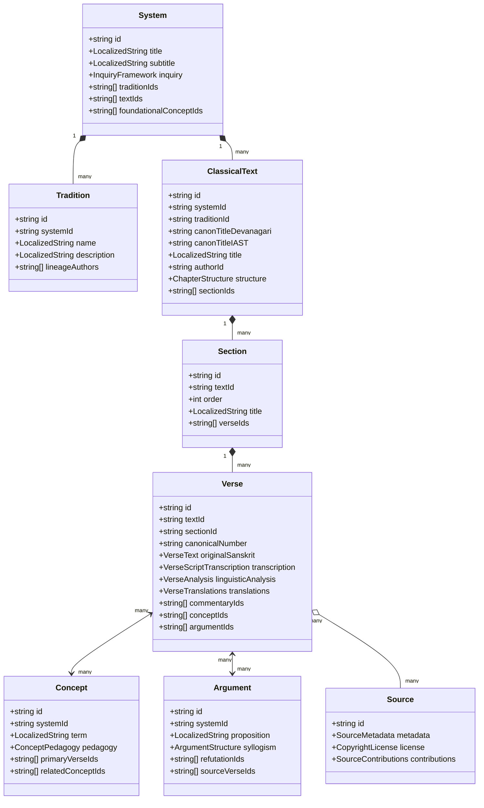
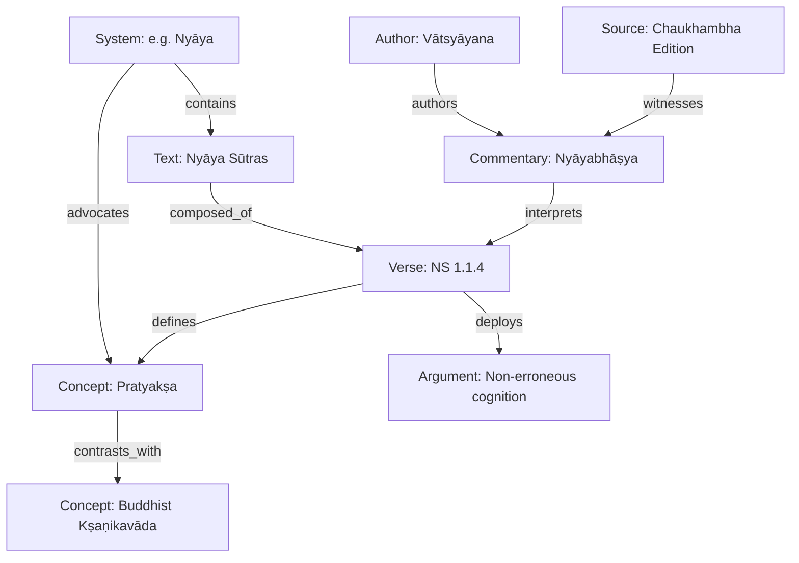
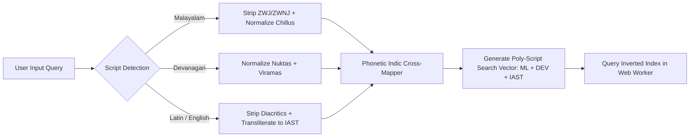
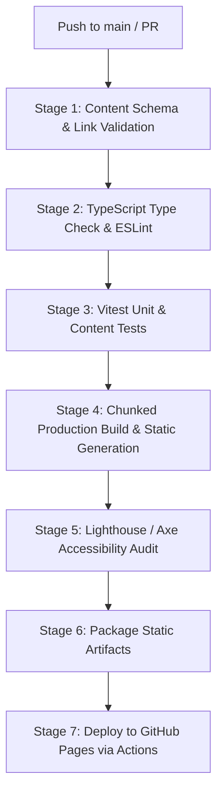

# DARŚANA — FUTURE TECHNICAL ARCHITECTURE ROADMAP
**Document Status:** Frozen / Authoritative Architectural Blueprint (Session 2)  
**Governing Charter:** [ROADMAP_SESSION_1.md](./ROADMAP_SESSION_1.md)  
**Scope:** Defines the complete technical architecture, data structures, ingestion pipelines, storage models, graph engine, search infrastructure, and migration pathway required to realize the Darśana Product Vision.

---

## 1. Current-State Assessment

An empirical inspection of the existing codebase (`samkhya-app`) reveals significant foundational craft, but also severe architectural bottlenecks that prevent scaling into a multi-source, Malayalam-first, source-grounded learning environment.

### 1.1 Detailed Inventory & Evaluation

| Area | Current Implementation | Status | Recommendation | Technical Rationale |
| :--- | :--- | :--- | :--- | :--- |
| **Application Core** | React 19 + Vite 6 + TypeScript 5.8 | **Retain & Enhance** | Keep | Modern, lightning-fast compiler toolchain, strong TS type-safety, excellent ecosystem support. |
| **Styling & Design System** | Tailwind CSS v4 (`@tailwindcss/vite`) + custom theme (`theme/colors.ts`) | **Refactor** | Standardize into Design Tokens | Colors (`sattva`, `rajas`, `tamas`, `avyakta`) provide atmospheric depth, but layout classes are tightly coupled to desktop views and lack strict typographic tokens for complex Malayalam glyph rendering. |
| **Content Storage & Bundling** | Static TypeScript source files under `src/content/` compiled directly into JavaScript via `index.ts` | **Replace** | Decouple into Headless Content Artifacts | **Critical Bottleneck:** Statically importing all texts into a single bundle creates a **12.6 MB monolithic JS asset** (`dist/assets/index-*.js`). Expanding to 5+ sources per Darśana will cause browser crashes on mobile devices. |
| **Content Schema** | `src/types/content.ts` & `src/types/i18n.ts` | **Replace** | Canonical Multi-layered Graph Schema | Content models treat verses as flat entities with single optional strings for `translation` and `commentary`. No fields exist for Malayalam Sanskrit transcription, padaccheda, anvaya, traditional commentators, or source provenance. |
| **Localization Model** | Hardcoded binary union `type SupportedLanguage = 'en' \| 'ml'` in React context | **Replace** | Headless Content Localization Engine | UI strings and content strings are intermingled; content lacks fallback cascades; adding a third language requires modifying the core TypeScript definitions across the entire repo. |
| **Data Relationships & Cross-Links** | Loose string arrays (`conceptIds?: ConceptId[]`) resolved via fuzzy regex at runtime in `src/utils/references.ts` | **Replace** | Build-Time Knowledge Graph (Nodes & Typed Edges) | Current runtime normalization (`normalizeRefId`) is defensive because IDs in text files drift. There is no typed relationship model (e.g., distinguishing whether a verse *defines*, *exemplifies*, or *refutes* a concept). |
| **Search Engine** | Main-thread in-memory scan in `src/utils/searchIndex.ts` running `.includes()` on verses | **Replace** | Web-Worker-Powered Inverted Multi-Entity Search | Main-thread index generation freezes mobile browsers. Only indexes verses; concepts, systems, arguments, commentators, and sources are invisible to search. No cross-script phonetic translation (Malayalam $\leftrightarrow$ IAST $\leftrightarrow$ Devanāgarī). |
| **Routing & Navigation** | React Router v8 `HashRouter` (`/#/...`) | **Replace** | Path-based Canonical URLs with SSG/SPA fallback | `HashRouter` breaks SEO, complicates deep linking, prevents clean OpenGraph card generation for social sharing, and treats concepts as child entities of texts (`/text/:t/concept/:c`) rather than system-level ontological realities. |
| **State Management** | React Context (`LanguageContext`, `ReadingContext`) | **Retain & Refactor** | Retain Context for UI state; IndexedDB for content | Clean and lightweight for user preferences (font size, theme, reading progress); needs an IndexedDB layer (via `idb` or Dexie) for offline corpus caching. |
| **Offline & PWA** | Vanilla Service Worker (`public/sw.js`) with hardcoded cache name | **Replace** | Workbox / Vite-PWA with Multi-Tier Storage | Current SW caches only runtime assets on demand. It lacks precache hashing, cannot selectively download entire Darśanas for offline use, and cannot perform background updates reliably. |
| **Visualizations** | Hardcoded React SVG components registered in `src/components/diagrams.ts` | **Refactor** | Reusable Data-Driven Visual Engine | Visualizations are tied directly to hardcoded React components instead of being generated from canonical graph specifications. |
| **Testing** | Vitest suite validating verse uniqueness and basic IDs (`content-integrity.test.ts`) | **Refactor & Expand** | Multi-tiered Validation Pipeline | Excellent start (193+ assertions), but lacks schema validation (Zod), Unicode normalization tests, translation completeness checks, and accessibility regression suites. |
| **CI / CD** | GitHub Actions (`ci.yml` and `deploy.yml`) | **Refactor** | Unified Build-Validate-Deploy Pipeline | Currently, `ci.yml` and `deploy.yml` duplicate build steps. Pages deployment failed due to environment protection rules rejecting branch `main`. |

---

## 2. Target Application Architecture

```
┌────────────────────────────────────────────────────────────────────────┐
│                          PRESENTATION LAYER                            │
│  ┌─────────────────────────┐  ┌─────────────────────────────────────┐  │
│  │    Reading Experience   │  │   Philosophical Exploration Engine  │  │
│  │ (Multi-layered Verses)  │  │ (Concept Maps, Arguments, Inquiries)│  │
│  └────────────┬────────────┘  └──────────────────┬──────────────────┘  │
│               │                                  │                     │
│  ┌────────────┴────────────┐  ┌──────────────────┴──────────────────┐  │
│  │   Visualizations & SVG  │  │      Search & Filter Palette        │  │
│  │ (Trees, Graphs, Tattvas)│  │    (Worker-backed, Multi-entity)    │  │
│  └────────────┬────────────┘  └──────────────────┬──────────────────┘  │
└───────────────┼──────────────────────────────────┼─────────────────────┘
                ▼                                  ▼
┌────────────────────────────────────────────────────────────────────────┐
│                         APPLICATION LOGIC & STATE                      │
│  ┌────────────────────────┐  ┌────────────────┐  ┌──────────────────┐  │
│  │    Reading Context     │  │ Language Store │  │ Navigation State │  │
│  │ (History, Bookmarks)   │  │ (ML / Indian EN│  │ (Path, Scroll)   │  │
│  └────────────┬───────────┘  └───────┬────────┘  └─────────┬────────┘  │
└───────────────┼──────────────────────┼─────────────────────┼───────────┘
                ▼                      ▼                     ▼
┌────────────────────────────────────────────────────────────────────────┐
│                        DATA ACCESS & CACHING LAYER                     │
│  ┌────────────────────────┐  ┌────────────────┐  ┌──────────────────┐  │
│  │   Content Provider     │  │  Graph Query   │  │ Search Worker    │  │
│  │ (On-demand Chunk Fetch)│  │     Engine     │  │ (Inverted Index) │  │
│  └────────────┬───────────┘  └───────┬────────┘  └─────────┬────────┘  │
│               ▼                      ▼                     ▼           │
│  ┌──────────────────────────────────────────────────────────────────┐  │
│  │          Client Storage Engine (IndexedDB + CacheStorage)         │  │
│  │     (Full offline caching, user bookmarks, reading history)      │  │
│  └───────────────────────────────────┬──────────────────────────────┘  │
└──────────────────────────────────────┼─────────────────────────────────┘
                                       ▼
┌────────────────────────────────────────────────────────────────────────┐
│                      COMPILED CANONICAL ARTIFACTS                      │
│   (Static JSON/CBOR files generated at build time, hosted on CDN)      │
│  ├── /data/systems/{id}.json                                           │
│  ├── /data/texts/{id}.json                                             │
│  ├── /data/verses/{id}.json                                            │
│  ├── /data/concepts/{id}.json                                          │
│  ├── /data/graph/adjacency-index.json                                  │
│  └── /data/search/search-index-{lang}.json                             │
└────────────────────────────────────────────────────────────────────────┘
```

### 2.1 Layer Boundaries & Responsibilities
1. **Presentation Layer (`src/views/`, `src/components/`):** Pure React functional components utilizing accessibility primitives, CSS design tokens, and semantic HTML5. No components may access raw static files directly; all data flows through React Query / Custom Hooks from the Data Access Layer.
2. **Application State Layer (`src/state/`):** Minimalist reactive state covering user preferences, language selection, font scaling, audio playback (if added), and reading bookmarks.
3. **Data Access Layer (`src/services/`):** Asynchronous repositories that query local IndexedDB first, falling back to static CDN-hosted chunked artifacts.
4. **Compiled Canonical Artifacts (`/public/data/`):** Pre-computed, immutable, content-addressable JSON/CBOR packages generated during the build pipeline from the raw knowledge repository.

---

## 3. Canonical Content Architecture

Content entities are completely decoupled from UI components. They are defined as normalized, relational schema models validated via Zod / JSON Schema.

### 3.1 Entity Hierarchy



---

## 4. Multi-Layered Textual Architecture

In accordance with Section 3 of the Constitutional Charter, every verse or aphorism is represented as a composite document comprising distinct, independently auditable layers.

### 4.1 Schema Definition for a Verse Entity

```typescript
export interface CanonicalVerse {
  id: string; // e.g., 'samkhya-karika-01'
  textId: string; // e.g., 'samkhya-karika'
  coordinates: {
    chapter?: number;
    section?: number;
    verseNumber: number;
    displayNumber: string; // e.g., '1.1' or '1'
  };

  /* LAYER 1: Canonical Devanāgarī (Unbroken Sanskrit) */
  originalText: {
    devanagari: string;
    meter?: string; // e.g., 'Āryā', 'Anuṣṭubh'
    provenanceSourceId: string;
  };

  /* LAYER 2: Malayalam Script Transcription */
  scriptTranscription: {
    malayalam: string; // Precise phonetic transcription into Malayalam glyphs
    rulesVersion: string; // Ruleset version used for transcription
  };

  /* LAYER 3: Standard IAST Transliteration */
  transliteration: {
    iast: string;
  };

  /* LAYER 4: Grammatical & Syntactical Decomposition */
  linguisticAnalysis: {
    padaccheda: {
      devanagari: string[];
      malayalam: string[];
      iast: string[];
    };
    anvaya: {
      proseOrderDevanagari: string;
      proseOrderMalayalam: string;
      proseOrderIAST: string;
    };
  };

  /* LAYER 5: Word-by-Word Gloss (Padārtha) */
  padartha: Array<{
    termDevanagari: string;
    termMalayalam: string;
    termIAST: string;
    grammaticalRole?: string; // e.g., 'noun.masc.nom.sg'
    meanings: {
      ml: string;
      en: string;
    };
  }>;

  /* LAYERS 6 & 7: Fluent Standard Translations */
  translations: {
    ml: Array<{
      id: string;
      sourceId: string;
      author: string;
      text: string;
      isDefault: boolean;
    }>;
    en: Array<{
      id: string;
      sourceId: string;
      author: string;
      text: string;
      isDefault: boolean;
    }>;
  };

  /* LAYER 8: Traditional Historical Commentaries */
  traditionalCommentaries: Array<{
    id: string;
    commentatorId: string;
    commentatorName: { ml: string; en: string; sa: string };
    workTitle: { ml: string; en: string; sa: string };
    sourceId: string;
    originalSanskrit?: string;
    translation: {
      ml?: string;
      en?: string;
    };
    excerpt?: string;
  }>;

  /* LAYER 9: Darśana Beginner Primer */
  beginnerExplanation: {
    ml: {
      summary: string; // 1-2 sentence core message
      analogy?: string; // Real-world metaphor
      intuition: string; // Plain-language breakdown
    };
    en: {
      summary: string;
      analogy?: string;
      intuition: string;
    };
  };

  /* LAYER 10: Deep Philosophical Exposition */
  philosophicalAnalysis: {
    ml: {
      doctrinalSignificance: string;
      dialecticalContext: string;
      counterPositionsRefuted?: string[];
    };
    en: {
      doctrinalSignificance: string;
      dialecticalContext: string;
      counterPositionsRefuted?: string[];
    };
  };

  /* LAYER 11: Textual Variants & Critical Apparatus */
  variants?: Array<{
    readingDevanagari: string;
    readingMalayalam: string;
    sourceWitness: string; // Manuscript / Edition reference
    notes: { ml?: string; en?: string };
  }>;

  /* LAYER 12: Knowledge Graph Links */
  relationalLinks: {
    conceptIds: string[];
    argumentIds: string[];
    crossReferenceVerseIds: string[];
    contrastingVerseIds?: string[];
  };
}
```

---

## 5. First-Class Source & Provenance Architecture

To ingest multiple Google Drive PDFs additively without data loss or copyright infringement, every piece of knowledge must be bound to a first-class **Source** entity.

### 5.1 The Source Entity Model

```typescript
export interface Source {
  id: string; // e.g., 'ssu-durga-saptashati-1998'
  biblio: {
    title: {
      original: string;
      transliterated?: string;
      translated?: { ml?: string; en?: string };
    };
    creators: Array<{
      name: string;
      role: 'author' | 'commentator' | 'editor' | 'translator' | 'compiler';
    }>;
    publisher?: string;
    publicationYear?: number;
    edition?: string;
    volume?: string;
    isbn?: string;
    institution?: string; // e.g., 'Sampurnanand Sanskrit Vishwavidyalaya'
  };
  digitalProvenance: {
    sourceType: 'google-drive-pdf' | 'archive-org' | 'critical-edition-print' | 'manuscript-scan';
    originalFileName?: string;
    archiveUrl?: string;
    ingestionDate: string; // ISO 8601
    sha256Checksum: string;
  };
  legalStatus: {
    classification: 'public-domain' | 'in-copyright-reproduced-with-permission' | 'fair-use-scholarly-digest';
    licenseType?: 'CC0' | 'CC-BY' | 'CC-BY-SA' | 'All-Rights-Reserved';
    permissionNotes?: string;
    allowedUsages: {
      verbatimFullText: boolean; // True if public domain or explicitly licensed
      derivativeTranslations: boolean;
      scholarlySnippetsOnly: boolean;
      factualTaxonomyExtraction: boolean;
    };
  };
  attribution: {
    citationStringML: string;
    citationStringEN: string;
    canonicalWebUrl?: string;
  };
}
```

### 5.2 Multi-Source Ingestion & Merge Rules (Non-Destructive)

When a second or third source for a text is ingested (e.g., *Sāṅkhya-kārikā* with *Gauḍapāda-bhāṣya* from Source A, and *Yuktidīpikā* from Source B):
1. **Primary Structural Anchor:** The canonical verse coordinate (`system.text.verseNumber`) serves as the immutable join key.
2. **Additive Array Stacking:** Commentaries, translations, and notes from Source B are appended into arrays with their distinct `sourceId`. They never overwrite Source A.
3. **Numbering & Structural Discrepancies:** When Source B uses divergent verse numbers or different chapter splits, a **Coordinate Mapping Matrix** is declared:
   ```json
   {
     "canonicalId": "nyaya-sutra-2.1.68",
     "sourceMappings": [
       { "sourceId": "source-vatsyayana", "localNumber": "2.1.68" },
       { "sourceId": "source-bhasarvajna", "localNumber": "2.1.69", "note": "Splits previous aphorism into two" }
     ]
   }
   ```
4. **Hermeneutical Conflict Preservation:** If Source A interprets a term in one tradition and Source B refutes it, both explanations coexist in the `traditionalCommentaries` or `philosophicalAnalysis` layers with clear lineage tags.

---

## 6. Knowledge Graph Architecture

Darśana is fundamentally a typed, directed knowledge graph.

### 6.1 Graph Schema Specification



#### Node Types
* `System`: Top-level Darśana (Nyāya, Sāṅkhya, Advaita, etc.).
* `Tradition`: Sub-school or lineage (e.g., Bhāṭṭa Mīmāṁsā, Prābhākara Mīmāṁsā).
* `Text`: Canonical work (*Sāṅkhyatattvakaumudī*, *Brahmasūtra*, etc.).
* `Section`: Structural division (Adhyāya, Pāda, Āhnika).
* `Verse`: Individual sūtra, kārikā, or śloka.
* `Concept`: Ontological, epistemological, or ethical category (*Pramāṇa*, *Satkāryavāda*).
* `Argument`: Formal philosophical syllogism or reasoning sequence.
* `Person`: Historical author, commentator, or redactor.
* `Source`: Specific published volume, manuscript, or digital asset.

#### Edge Types (Typed Relationships)
| Edge Type | Source Node $\rightarrow$ Target Node | Semantic Definition |
| :--- | :--- | :--- |
| `contains` | `System` $\rightarrow$ `Text`, `Text` $\rightarrow$ `Verse` | Strict hierarchical containment. |
| `defines` | `Verse` $\rightarrow$ `Concept` | Verse provides canonical definition of concept. |
| `exemplifies` | `Verse` $\rightarrow$ `Concept` | Verse uses concept in demonstration. |
| `presupposes` | `Concept` $\rightarrow$ `Concept` | Conceptual dependency (A cannot be understood without B). |
| `refutes` | `Argument` / `Verse` $\rightarrow$ `Concept` / `Argument` | Polemical refutation of a counter-position (*Pūrvapakṣa*). |
| `analogous_to` | `Concept` $\rightarrow$ `Concept` | Cross-system structural parallel. |
| `comments_on` | `Commentary` $\rightarrow$ `Verse` | Traditional lineage commentary on root text. |
| `witnesses` | `Source` $\rightarrow$ `Text` / `Commentary` | Bibliographical provenance. |

### 6.2 Graph Storage & Query Strategy
* **Build-Time Compilation:** The graph is resolved during the CI/CD content build into a compressed **Adjacency & Relationship Matrix** (`/data/graph/graph-index.json`).
* **Zero Runtime Overhead:** Graph lookups are $O(1)$ dictionary queries rather than runtime traversal sweeps.
* **Bi-directional Indexing:** Every edge `A -> B` automatically generates the inverse index `B <- A` at build time.

---

## 7. Search Architecture

The future search engine must index massive multi-lingual and multi-script content while maintaining sub-15ms response times on mobile devices.

### 7.1 Multi-Script Normalization Pipeline



### 7.2 Technical Search Engine Specifications
1. **Web-Worker Offloading:** Search executes in a dedicated Web Worker (`src/workers/search.worker.ts`). The main React rendering thread is never blocked during indexing or execution.
2. **Multi-Entity Indexing:** Indexes all entities across the Darśana universe:
   * Verses (Number, original Sanskrit, Malayalam transcription, translations, word glosses).
   * Concepts (Malayalam term, Sanskrit name, English translation, simplified primer).
   * Philosophical Arguments (Proposition, counter-positions).
   * Systems & Texts (Titles, author names, historical background).
   * Commentators & Sources.
3. **Cross-Script Search Matching:** A user typing in Malayalam (e.g., `പ്രത്യക്ഷം`) will automatically match:
   * Malayalam texts containing `പ്രത്യക്ഷം`.
   * Devanāgarī texts containing `प्रत्यक्षम्`.
   * IAST transcriptions containing `pratyakṣam`.
   * English explanations containing `perception` or `pratyaksha`.
4. **Faceted Querying:** Supports advanced syntax: `system:nyaya concept:pramana type:verse "sense contact"`.

---

## 8. Content Ingestion Pipeline (From Google Drive to Production)

Future PDF sources will be ingested through an automated, repeatable, and verifiable pipeline:

```
[ Google Drive PDF Ingestion ]
           │
           ▼
[ 1. Ingestion & Hashing ] ── SHA-256 verification, metadata registration
           │
           ▼
[ 2. Text & OCR Extraction ] ── High-accuracy Indic OCR / Digital text stream
           │
           ▼
[ 3. Structure Parsing ] ── Sūtra detection, chapter demarcation, commentary parsing
           │
           ▼
[ 4. Script & Language Separation ] ── Sanskrit root vs. Malayalam/Hindi/English commentary
           │
           ▼
[ 5. Phonetic Transcription Engine ] ── Generates Malayalam transcription & IAST from Sanskrit
           │
           ▼
[ 6. Pedagogical Scaffolding (AI-assisted) ] ── Drafts 7-step beginner primers & word glosses
           │
           ▼
[ 7. Provenance Tagging & Licensing ] ── Enforces fair use / public domain compliance
           │
           ▼
[ 8. Deterministic Validation Gate ] ── Schema checks, link integrity, Unicode validation
           │
           ▼
[ 9. Scholarly Human Review ] ── Editorial sign-off on translations and concepts
           │
           ▼
[ 10. Canonical Knowledge Commit ] ── Stored in canonical repository format
```

### 8.1 Automation vs. Human Verification Policy
* **Fully Automated (Deterministic):** Hashing, OCR extraction, phonetic script transcription (Devanāgarī $\rightarrow$ Malayalam $\rightarrow$ IAST), verse coordinate parsing, schema validation, graph link verification.
* **AI-Assisted:** Drafting initial plain-language beginner summaries, identifying candidate cross-references, drafting initial word-by-word glosses (*padārtha*).
* **Mandatory Human Scholarly Review:** Final approval of philosophical definitions, verification of traditional commentary attributions, sign-off on legal copyright classifications.

---

## 9. Content Validation Architecture

Every build enforces an exhaustive, deterministic validation gate. A build **fails immediately** if any of the following checks violate constraints:

1. **Identifier Uniqueness:** All `systemId`, `textId`, `verseId`, `conceptId`, `argumentId`, and `sourceId` tokens are globally unique.
2. **Referential Integrity (Zero Broken Links):** Every referenced ID in `relatedConceptIds`, `verseIds`, `sourceId`, and `commentatorId` must resolve to an existing entity. No dangling references are permitted.
3. **Unicode & Script Sanity:**
   * Sanskrit verses contain only valid Devanāgarī / Vedic codepoint ranges.
   * Malayalam transcriptions contain valid Malayalam codepoints; zero illegal zero-width sequences or homoglyphic mix-ups (e.g., preventing Tamil codepoints in Malayalam text).
   * All IAST strings adhere strictly to Unicode decomposed/composed normalization forms (NFC).
4. **Multi-layer Completeness Gate:**
   * Every verse marked `complete` must have: original Sanskrit, Malayalam transcription, IAST, at least one Malayalam translation, and a beginner explanation.
5. **Attribution Audit:** Every commentary and translation must declare a valid `sourceId` registered in the Source catalog.

---

## 10. Performance & Scalability Architecture

### 10.1 Eliminating the Monolithic Bundle
The current 12.6 MB monolithic bundle is dismantled in favor of **Dynamic Content Chunking**:
1. **Core Application Shell:** Ultra-lean SPA shell (< 150 kB gzipped) containing only the UI framework, routing, theme engine, and foundational typography.
2. **Route-Level Code Splitting:** `Home`, `PhilosophicalExploration`, `VerseReader`, `ConceptExplorer`, and `SearchModal` are loaded lazily on demand.
3. **On-Demand Content Chunking:**
   * Each philosophical system metadata is chunked: `/data/systems/{systemId}.json`.
   * Text verses are partitioned by chapter / book (e.g., `/data/texts/{textId}/chapter-{n}.json`).
   * A user exploring Sāṅkhya downloads *only* Sāṅkhya files; Nyāya or Vedānta files remain on the CDN until accessed.

### 10.2 Client-Side Caching Strategy (IndexedDB)
* When a user browses a text, the fetched JSON chunks are written to browser IndexedDB storage using a content-hash key.
* Subsequent reads for the same verses or concepts are resolved from local storage in < 2ms without network latency.

---

## 11. Publishing, Deep Linking & URL Architecture

URLs must remain permanent, human-readable, and semantic. `HashRouter` is deprecated in favor of **Clean Canonical URLs**:

| View | Canonical URL Pattern | Example |
| :--- | :--- | :--- |
| **System Overview** | `/:lang/system/:systemId` | `/ml/system/samkhya` |
| **Philosophical Exploration** | `/:lang/system/:systemId/explore` | `/ml/system/nyaya/explore` |
| **Text Reader** | `/:lang/text/:textId` | `/ml/text/samkhya-karika` |
| **Chapter / Section** | `/:lang/text/:textId/:sectionNumber` | `/ml/text/yoga-sutras/pada-1` |
| **Specific Verse** | `/:lang/text/:textId/verse/:verseCoord` | `/ml/text/samkhya-karika/verse/1` |
| **Independent Concept** | `/:lang/concept/:conceptId` | `/ml/concept/satkaryavada` |
| **Philosophical Argument** | `/:lang/argument/:argumentId` | `/ml/argument/purusha-multiplicity` |
| **Source Catalog** | `/:lang/source/:sourceId` | `/ml/source/ssu-durga-saptashati` |

* **OpenGraph & Social Sharing:** Static prerendering generates meta-tags for key landing pages, enabling informative previews on WhatsApp, Telegram, Twitter, etc., rendered in Malayalam.

---

## 12. Offline & PWA Architecture

A serious educational tool must function completely offline on commuter trains, in rural areas, or during intermittent network connectivity.

1. **Modern Service Worker Engine:** Migrated to Workbox via `vite-plugin-pwa` with explicit precache manifests for the core application shell.
2. **Selective Offline Downloads:**
   * Users can tap: *"Download entire Sāṅkhya tradition for offline reading"* (Downloads corresponding JSON chunks and caches them in IndexedDB).
   * Visual indicator in UI showing offline availability per system.
3. **Offline Search:** Because the search index is modularized and executes within a Web Worker, full offline search continues to work on all cached content without network access.

---

## 13. Visualization & Graphic Engine Architecture

Darśana will provide rich, interactive spatial representations of complex philosophical systems.

1. **Declarative Visualization Specifications:** Diagrams must not be hardcoded React SVGs. They are specified as declarative data models:
   ```typescript
   export interface VisualGraphSpec {
     id: string;
     title: { ml: string; en: string };
     type: 'tattva-hierarchy' | 'syllogism-tree' | 'comparative-matrix' | 'lineage-timeline';
     nodes: VisualNode[];
     edges: VisualEdge[];
   }
   ```
2. **Standardized Rendering Engine:** A single, high-performance rendering engine (leveraging SVG / Canvas and CSS motion tokens) renders the graphs.
3. **Accessibility Mirroring:** Every visualization must provide a semantic, screen-reader-accessible HTML table or outline view (`aria-details`) as a direct alternative.

---

## 14. Accessibility Architecture (A11y)

In compliance with the Constitutional Charter, intellectual depth must be universally accessible:
1. **Malayalam Typography Engine:**
   * Font stack prioritizes modern, high-legibility Malayalam open-source typefaces (e.g., *Gayathri*, *Manjari*, *Noto Serif Malayalam*).
   * Engineered line heights ($1.8 \times$) and character spacing preventing vowel sign / virāma clipping on high-density screens.
2. **Screen Reader Semantic Landmarks:** Every screen uses rigorous ARIA landmarks (`main`, `nav`, `article`, `complementary`, `region`).
3. **Cognitive & Motion Preferences:**
   * Full compliance with `prefers-reduced-motion`: all animated transitions and graph expansions dissolve instantaneously when requested.
   * Distinct high-contrast dark and light modes with a minimum contrast ratio of $7:1$ for textual content.

---

## 15. Testing & Quality Assurance Architecture

The testing suite must defend content integrity and code quality across five distinct layers:

```
┌────────────────────────────────────────────────────────┐
│ 5. End-to-End & Cross-Browser Tests (Playwright)       │
│    (Navigation flows, offline mode, search dialog)     │
├────────────────────────────────────────────────────────┤
│ 4. Accessibility Tests (Axe-core / Vitest-A11y)        │
│    (Color contrast, ARIA landmarks, keyboard traps)    │
├────────────────────────────────────────────────────────┤
│ 3. Content & Knowledge Graph Integrity Tests           │
│    (Zero broken links, valid IDs, Sanskrit encoding)   │
├────────────────────────────────────────────────────────┤
│ 2. Schema Validation Tests (Zod / JSON Schema)         │
│    (Validates every canonical JSON artifact on build)  │
├────────────────────────────────────────────────────────┤
│ 1. Unit Tests (Vitest)                                 │
│    (Script normalizers, search scorers, formatters)    │
└────────────────────────────────────────────────────────┘
```

---

## 16. Unified CI/CD Pipeline Architecture

Resolves the dual-workflow redundancy and environment permission issues identified in Session 1:



* **Single Pipeline:** Consolidate `ci.yml` and `deploy.yml` into a unified pipeline where deployment occurs immediately after successful test and validation stages, eliminating duplicated steps.
* **Environment Security:** The `github-pages` environment must be configured to permit deployment directly from `main`.

---

## 17. Master Target Architecture Diagram

```
                                  [ PRIMARY SOURCES ]
             (Google Drive PDFs, Sanskrit Texts, Lineage Commentaries)
                                           │
                                           ▼
                            [ INGESTION & OCR PIPELINE ]
                                           │
                        ┌──────────────────┴──────────────────┐
                        ▼                                     ▼
             [ Deterministic Extraction ]           [ AI-Assisted Scaffolding ]
             • Verse coordinates                    • Draft word-glosses
             • Devanagari text                      • Draft beginner primers
             • Malayalam script transcription       • Candidate cross-links
                        │                                     │
                        └──────────────────┬──────────────────┘
                                           ▼
                             [ SCHOLARLY HUMAN REVIEW ]
                                           │
                                           ▼
                          [ CANONICAL KNOWLEDGE REPOSITORY ]
                 (Decoupled JSON/YAML Content Models, Source Provenance)
                                           │
                         ┌─────────────────┼─────────────────┐
                         ▼                 ▼                 ▼
                 [ Search Index ]   [ Graph Compiler ] [ Content Chunking ]
                 • Poly-script      • Nodes & edges    • Per-system/text
                 • Inverted index   • Cross-references • Compressed JSON
                         │                 │                 │
                         └─────────────────┼─────────────────┘
                                           ▼
                               [ STATIC ASSET CDN ]
                                           │
                                           ▼
                   ═════════════════════════════════════════
                                DARŚANA CLIENT APP
                   ═════════════════════════════════════════
                                           │
                  ┌────────────────────────┼────────────────────────┐
                  ▼                        ▼                        ▼
       [ Presentation Engine ]     [ Offline Engine ]      [ Exploration Engine ]
       • Malayalam-first UI        • IndexedDB Cache       • Concept Maps
       • 12-Layer Verse Reader     • Service Worker        • Argument Trees
       • Script Transcriptions     • Offline Search        • Dialectical Views
                  │                        │                        │
                  └────────────────────────┼────────────────────────┘
                                           ▼
                              [ PROGRESSIVE LEARNER ]
       Zero Knowledge  ──▶  Basic Intuition  ──▶  Conceptual Literacy  ──▶  Primary Sources
```

---

## 18. Migration Strategy From Existing Repository

Migration will occur iteratively without breaking current deployment:

1. **Phase A (Foundational Decoupling):**
   * Define canonical Zod schemas in `src/core/schema/`.
   * Write an automated migration script to transform existing `src/content/` TypeScript objects into normalized JSON files under `content/canonical/`.
2. **Phase B (Build-Time Pipeline Setup):**
   * Implement the content compiler that outputs chunked JSON to `public/data/`.
   * Replace the runtime monolithic `systems` array with an asynchronous repository pattern.
3. **Phase C (Search & Worker Modernization):**
   * Move search into a dedicated Web Worker.
   * Implement phonetic Indic cross-script matching.
4. **Phase D (UI & Navigation Evolution):**
   * Introduce the 12-layer verse viewing component.
   * Introduce the first-class `PhilosophicalExploration` system view.
   * Upgrade routing to canonical path-based URLs.

---

## 19. Major Architectural Decisions & Postponements

### 19.1 Frozen Architectural Decisions (Agreed & Non-Negotiable)
1. **Headless Content Separation:** Content definitions must never again reside inside React application code or monolithic client bundles.
2. **Chunked On-Demand Loading:** The client application loads content per-tradition and per-chapter via asynchronous fetches and IndexedDB caching.
3. **12-Layer Textual Model:** Every verse supports discrete, auditable layers separating original Sanskrit, Malayalam transcription, word meanings, commentaries, and beginner primers.
4. **First-Class Sources:** Every textual claim, commentary, and translation is explicitly tied to a verified `sourceId` with unambiguous copyright metadata.
5. **Worker-Backed Search:** Search index operations and multi-script normalization run off the main thread in a Web Worker.

### 19.2 Deliberately Postponed Decisions (To Be Resolved in Later Sessions)
* **Specific Database Backend for Authoring:** Whether community or scholarly contribution will use a headless Git-based CMS (Decap, Tina) or a dedicated database (PostgreSQL/Supabase) is postponed to Session 4 (Source Ingestion).
* **Specific Graph Rendering Library:** Choice between Cytoscape.js, D3.js, or lightweight custom SVG layout algorithms is postponed to Session 5 (UI/UX Architecture).
* **Audio Recitation Integration:** Storage and streaming protocols for Sanskrit chanting and Malayalam pronunciation are postponed to a subsequent media roadmap session.
