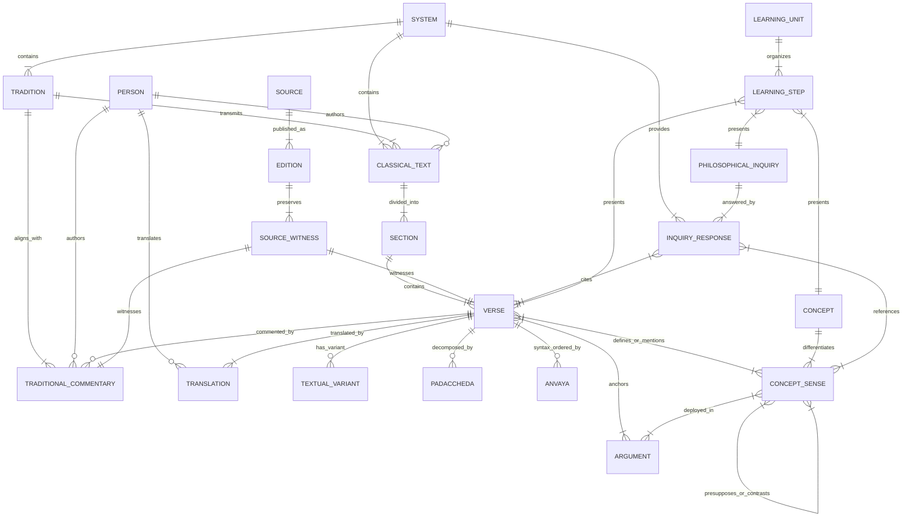

# DARŚANA — ROADMAP SESSION 3
# CANONICAL CONTENT, ENTITY & KNOWLEDGE MODEL

**Document Status:** Frozen / Authoritative Specification  
**Governing Charters:** [ROADMAP_SESSION_1.md](./ROADMAP_SESSION_1.md) (Product Vision) & [ROADMAP_SESSION_2.md](./ROADMAP_SESSION_2.md) (Technical Architecture)  
**Scope:** Defines the complete canonical knowledge model, entity schemas, multi-layered verse structures, polysemic concept representations, dialectical argument graphs, source provenance, and relationship taxonomy for Darśana.

---

## 1. Purpose & First Principle: The Principle of Headless Knowledge

The purpose of this session is to specify the **Universal Knowledge Core** of the Darśana project.

### 1.1 The First Principle
> **The canonical model is designed around philosophical and historical reality, completely independent of UI components, frontend frameworks, or client rendering constraints.**

In previous iterations, data structures were subordinate to the user interface: fields were added or omitted based on what a specific React screen needed to render, and content was statically bound inside TypeScript files (`src/content/`).

Under the **Principle of Headless Knowledge**:
1. **Ontological Sovereignty:** A philosophical system, a traditional commentary, a syllogistic argument, or a Sanskrit aphorism exists as a structured, self-describing entity whether rendered in React, queried via an API, transformed into an e-book, or displayed in a terminal.
2. **Immutability Against UI Refactors:** The entire presentation layer (Tailwind, React, Vite, components) can be discarded, rewritten, or rebuilt from scratch without altering a single byte of the canonical knowledge base.
3. **Cumulative Growth:** The model accommodates multiple historical witnesses, divergent translations, conflicting lineage commentaries, and progressive pedagogical scaffolds without schema migration or data destruction.

---

## 2. Canonical Entity Universe

The Darśana domain consists of **First-Class Entities** (independent lifecycle, persistent URI, standalone queryable) and **Embedded Sub-entities** (context-dependent data structures bound to an entity).

```
┌──────────────────────────────────────────────────────────────────────────────────┐
│                             CANONICAL ENTITY UNIVERSE                            │
├──────────────────────────────────────┬───────────────────────────────────────────┤
│ FIRST-CLASS INDEPENDENT ENTITIES     │ EMBEDDED SUB-ENTITIES                     │
├──────────────────────────────────────┼───────────────────────────────────────────┤
│ • Philosophical System (Darśana)     │ • Padaccheda (Linguistic Word Splits)     │
│ • Tradition / Lineage (Sampradāya)   │ • Anvaya (Prose Syntactical Order)        │
│ • Person (Author, Commentator, Sage) │ • Padārtha (Word-by-word Glosses)         │
│ • Classical Text (Grantha)           │ • Script Transcription (Malayalam Glyphs) │
│ • Text Section (Adhyāya, Pāda)       │ • Textual Variant (Pāṭhabheda)            │
│ • Verse / Sūtra / Kārikā / Śloka     │ • Pedagogical Scaffolding (7-step Primer) │
│ • Concept (Tattva / Padārtha)        │ • License & Rights Declaration            │
│ • Concept Sense (System-Specific)    │ • Coordinates & Pagination                │
│ • Argument (Syllogism / Yukti)       │ • Citations & Evidence Fragments          │
│ • Philosophical Inquiry (Question)   │                                           │
│ • Traditional Commentary (Bhāṣya)    │                                           │
│ • Translation (Localized Rendering)  │                                           │
│ • Source (Primary Literature / Scan) │                                           │
│ • Edition (Specific Witness / Print) │                                           │
│ • Knowledge Graph Edge               │                                           │
│ • Learning Unit (Pedagogical Module) │                                           │
└──────────────────────────────────────┴───────────────────────────────────────────┘
```

### 2.1 Entity Boundary Rationales
* **Why `ConceptSense` is a first-class entity separate from `Concept`:** A Sanskrit term such as *Prakṛti* or *Pramāṇa* is lexically unified, but doctrinally polysemic. Sāṅkhya's *Prakṛti* (unconscious material matrix) contradicts Advaita's *Prakṛti* (indefinable *Māyā*). Modeling `ConceptSense` as an independent entity prevents conflation while preserving lexical unity.
* **Why `TraditionalCommentary` is a first-class entity:** Commentaries (*Bhāṣyas*, *Ṭīkās*, *Vārttikas*) are standalone literary and philosophical masterpieces authored by historical figures (Śaṅkara, Vyāsa, Vātsyāyana). They are not mere string attributes of a verse; they have their own authors, dates, philosophical agendas, and sub-commentaries.
* **Why `Translation` is an independent entity:** A single verse may have five translations in Malayalam and four in English across different scholarly lineages. Forcing a single `translation` string inside a verse destroys provenance.
* **Why `Padaccheda` and `Anvaya` are embedded:** Word splitting and prose order are linguistic structural properties of a specific verse's Sanskrit text; they have no standalone existential identity outside the verse.

---

## 3. Persistent Identifier (ID) Strategy

To ensure permanent deep-linking, cross-referencing, and multi-source stability, all canonical entities utilize a **Uniform Resource Name (URN)** standard.

### 3.1 Identifier Syntax
All IDs are lower-case, ASCII-only, hyphen-separated, colon-delimited URNs:

$$\text{urn:darshana:}\{\text{entity-type}\}:\{\text{hierarchy-or-slug}\}$$

```text
urn:darshana:system:samkhya
urn:darshana:tradition:samkhya:classical
urn:darshana:person:isvarakrsna
urn:darshana:person:adi-shankara
urn:darshana:text:samkhya-karika
urn:darshana:section:samkhya-karika:karikas
urn:darshana:verse:samkhya-karika:1
urn:darshana:concept:purusha
urn:darshana:sense:purusha:samkhya
urn:darshana:argument:samkhya:purusha-multiplicity
urn:darshana:inquiry:nature-of-suffering
urn:darshana:source:ssu-durga-saptashati-1998
urn:darshana:edition:ssu-durga-saptashati-1998:print-1
urn:darshana:commentary:samkhya-karika:gaudapada:1
urn:darshana:translation:samkhya-karika:1:ml:namboodiri-1972
urn:darshana:edge:sk1-defines-duhkha
urn:darshana:unit:intro-to-samkhya-metaphysics
```

### 3.2 Immutability Invariants
1. **Language Neutrality:** IDs are derived from standard IAST romanization of canonical Sanskrit titles (e.g., `samkhya-karika`, not `sankhya-charitham`). They never change when switching UI languages.
2. **Route Agnosticism:** IDs contain zero URL fragments (`/`, `#`, `?`). They are location-independent.
3. **Resilience to Restructuring:**
   * If a translation is re-authored, the `urn:darshana:verse:*` ID remains immutable; only the `urn:darshana:translation:*` entity updates or increments its revision.
   * If a second historical source provides the same verse, the canonical verse ID remains the shared anchor; the second source is attached via a new `SourceWitness` record.
   * If a new critical edition renumbers verses (e.g., Nyāya Sūtra 2.1.68 vs 2.1.69), the canonical ID anchors the conceptual passage, and an **Edition Coordinate Alias** resolves the discrepant number.

---

## 4. Multi-Layered Verse Model

Every verse, sūtra, kārikā, or passage conforms to the **12-Layer Textual Model** established in Session 1:

```
┌────────────────────────────────────────────────────────────────────────┐
│                        VERSE ENTITY: 12 LAYERS                         │
├────┬──────────────────────────────────┬───────────┬────────┬───────────┤
│ #  │ Layer                            │ Multi     │ Proven │ Mandatory │
├────┼──────────────────────────────────┼───────────┼────────┼───────────┤
│ 1  │ Original Sanskrit (Devanāgarī)   │ No        │ Yes    │ Yes       │
│ 2  │ Malayalam Script Transcription   │ No        │ Rules  │ Yes       │
│ 3  │ IAST Transliteration             │ No        │ Algor. │ Yes       │
│ 4  │ Padaccheda (Word Splits)         │ Alternate │ Yes    │ Optional  │
│ 5  │ Anvaya (Prose Order)             │ Alternate │ Yes    │ Optional  │
│ 6  │ Padārtha (Word-by-word Gloss)    │ By Lang   │ Edit.  │ Optional  │
│ 7  │ Malayalam Translation            │ Yes       │ Yes    │ Yes (>=1) │
│ 8  │ Indian English Translation       │ Yes       │ Yes    │ Yes (>=1) │
│ 9  │ Traditional Commentaries         │ Yes       │ Yes    │ Optional  │
│ 10 │ Darśana Beginner Primer (7-step) │ By Lang   │ Edit.  │ Yes       │
│ 11 │ Philosophical Analysis & Debates │ By Lang   │ Edit.  │ Optional  │
│ 12 │ Scholarly Apparatus & Variants   │ Yes       │ Yes    │ Optional  │
└────┴──────────────────────────────────┴───────────┴────────┴───────────┘
```

### 4.1 Formal Schema: Canonical Verse

```typescript
export interface CanonicalVerse {
  id: string; // 'urn:darshana:verse:samkhya-karika:1'
  textId: string; // 'urn:darshana:text:samkhya-karika'
  sectionId: string; // 'urn:darshana:section:samkhya-karika:karikas'
  canonicalCoordinate: {
    major: number; // e.g., 1 (Adhyaya / Book)
    minor?: number; // e.g., 1 (Pada / Section)
    verse: number; // e.g., 1 (Sutra / Karika)
    displayString: string; // '1' or '1.1.1'
  };

  /* LAYER 1: Original Sanskrit (Devanagari) */
  originalText: {
    devanagari: string;
    meter?: string; // 'Arya', 'Anustubh', 'Tristubh'
    sourceId: string; // 'urn:darshana:source:...'
  };

  /* LAYER 2: Malayalam Script Transcription */
  scriptTranscription: {
    malayalam: string; // Phonetically precise transcription
    engineVersion: string; // 'darshana-indic-trans-1.0'
  };

  /* LAYER 3: IAST Transliteration */
  transliteration: {
    iast: string; // NFC normalized
  };

  /* LAYER 4: Padaccheda (Word Splits) */
  padaccheda?: {
    devanagari: string[];
    malayalam: string[];
    iast: string[];
    sourceId?: string;
  };

  /* LAYER 5: Anvaya (Syntactical Prose Order) */
  anvaya?: {
    devanagari: string;
    malayalam: string;
    iast: string;
    sourceId?: string;
  };

  /* LAYER 6: Padārtha (Word Glosses) */
  padartha?: Array<{
    termDevanagari: string;
    termMalayalam: string;
    termIAST: string;
    grammaticalAnalysis?: string; // 'noun.masc.ins.sg'
    gloss: LocalizedString; // { ml: '...', en: '...' }
  }>;

  /* LAYERS 7 & 8: Multi-Translations */
  translationIds: string[]; // Pointer to urn:darshana:translation:* entities
  defaultTranslationId: {
    ml: string;
    en: string;
  };

  /* LAYER 9: Traditional Commentaries */
  commentaryIds: string[]; // Pointer to urn:darshana:commentary:* entities

  /* LAYER 10: Darśana Beginner Primer (7-Step Scaffolding) */
  beginnerPrimer: {
    ml: BeginnerScaffolding;
    en: BeginnerScaffolding;
  };

  /* LAYER 11: Deep Philosophical Analysis */
  philosophicalAnalysis?: {
    ml: PhilosophicalAnalysisContent;
    en: PhilosophicalAnalysisContent;
  };

  /* LAYER 12: Scholarly Apparatus & Textual Variants */
  variants?: Array<{
    id: string;
    witnessSourceId: string;
    variantDevanagari: string;
    variantMalayalam: string;
    variantIAST: string;
    affectedTerms: string[];
    scholarlyNote: LocalizedString;
  }>;

  /* Editorial & Governance Metadata */
  maturity: ContentMaturityStatus;
  rights: EntityRights;
}
```

---

## 5. Multiple Translations Architecture

Translations are first-class, attributed, multi-version entities.

```typescript
export interface Translation {
  id: string; // 'urn:darshana:translation:samkhya-karika:1:ml:namboodiri-1972'
  verseId: string; // 'urn:darshana:verse:samkhya-karika:1'
  language: string; // 'ml', 'en', 'hi', etc.
  translator: {
    personId?: string;
    name: string;
    lineageOrSchool?: string;
  };
  sourceId: string; // 'urn:darshana:source:...'
  translationText: string;
  register: 'literal' | 'idiomatic' | 'poetic' | 'philosophical';
  isDefault: boolean;
  divergenceNotes?: LocalizedString; // Explains why this translator interpreted differently
  maturity: ContentMaturityStatus;
  rights: EntityRights;
}
```

* **Default Selection Engine:** Each verse defines a preferred default translation per language, selected for clarity and historical fidelity.
* **Side-by-Side Comparison:** The UI can query all translations for a verse, allowing learners to contrast literal word-renderings with interpretative translations.

---

## 6. Commentary Architecture

Traditional commentaries are independent works of philosophy.

```typescript
export interface TraditionalCommentary {
  id: string; // 'urn:darshana:commentary:samkhya-karika:gaudapada:1'
  verseId: string; // 'urn:darshana:verse:samkhya-karika:1'
  workTitle: LocalizedString; // { sa: 'गौडपादभाष्यम्', ml: 'ഗൗഡപാദഭാഷ്യം', en: 'Gauḍapāda-bhāṣya' }
  commentatorId: string; // 'urn:darshana:person:gaudapada'
  traditionId: string; // 'urn:darshana:tradition:samkhya:classical'
  sourceId: string; // 'urn:darshana:source:...'
  
  /* Hierarchy (e.g. Tika commenting on a Bhasya) */
  parentCommentaryId?: string;
  commentaryTier: 'mula-bhasya' | 'tika' | 'varttika' | 'tippani';

  /* Content */
  sanskritOriginal?: {
    devanagari: string;
    malayalam: string;
    iast: string;
  };
  translation: {
    ml?: { text: string; translatorId?: string; sourceId: string };
    en?: { text: string; translatorId?: string; sourceId: string };
  };
  coreExegesisSummary: LocalizedString; // 2-3 sentence digest of the commentator's stance
  
  maturity: ContentMaturityStatus;
  rights: EntityRights;
}
```

---

## 7. Philosophical Argument Model

Darśana structures classical Indian philosophical reasoning as computable argument graphs, capturing both Nyāya syllogisms and cross-tradition polemical debates.

```typescript
export interface PhilosophicalArgument {
  id: string; // 'urn:darshana:argument:samkhya:purusha-multiplicity'
  systemId: string; // 'urn:darshana:system:samkhya'
  traditionId?: string;
  title: LocalizedString; // 'Proof of the Plurality of Puruṣas'
  
  /* Core Thesis */
  thesisProposition: LocalizedString; // 'Consciousness (Puruṣa) is many, not one'

  /* Structural Inference Framework */
  logicModel: 'nyaya-panchavayava' | 'buddhist-trairupya' | 'dialectical-debate';
  
  /* Nyāya 5-Member Syllogism (where applicable) */
  nyayaSyllogism?: {
    pratijna: LocalizedString;  // Proposition: 'The hill has fire'
    hetu: LocalizedString;      // Ground / Reason: 'Because it has smoke'
    udaharana: {                // Exemplification + Invariable Concomitance (Vyāpti)
      rule: LocalizedString;    // 'Wherever there is smoke, there is fire'
      example: LocalizedString; // 'Like a domestic hearth (mahānasa)'
    };
    upanaya: LocalizedString;   // Application: 'This hill possesses smoke accompanied by fire'
    nigamana: LocalizedString;  // Conclusion: 'Therefore, this hill has fire'
  };

  /* Dialectical Context */
  context: {
    purvapaksha: {
      opposingSystemId: string; // 'urn:darshana:system:advaita-vedanta'
      opposingClaim: LocalizedString; // 'The Self is single and universal'
      objectionSummary: LocalizedString;
    };
    siddhanta: {
      refutationMethod: 'anupalabdhi' | 'reductio-ad-absurdum' | 'pramana-virodha';
      demonstration: LocalizedString;
    };
  };

  /* Textual Witnesses */
  anchorVerseIds: string[]; // ['urn:darshana:verse:samkhya-karika:18']
  commentaryReferences: string[];
}
```

---

## 8. Concept Model & Polysemy

Concepts are the primary mental anchors for beginners.

```typescript
export interface CanonicalConcept {
  id: string; // 'urn:darshana:concept:prakriti'
  lexicalTerm: {
    devanagari: string; // 'प्रकृति'
    malayalam: string; // 'പ്രകൃതി'
    iast: string; // 'prakṛti'
    etymology?: {
      root: string; // 'pra + kṛ + ktin'
      literalMeaning: LocalizedString;
    };
  };
  category: 'ontology' | 'epistemology' | 'ethics' | 'theology' | 'psychology' | 'dialectics';
  
  /* System-Specific Senses (Resolves Polysemy) */
  senseIds: string[]; // Pointers to urn:darshana:sense:prakriti:*

  /* Cross-System Synonyms & Opposites */
  opposites?: string[]; // ['urn:darshana:concept:purusha']
  structuralEquivalents?: Array<{
    targetConceptId: string; // 'urn:darshana:concept:pradhana'
    nature: 'exact-synonym' | 'functional-equivalent' | 'near-parallel';
  }>;
}
```

---

## 9. System-Specific Meanings (`ConceptSense`)

To resolve polysemy without duplication or distortion:

```typescript
export interface ConceptSense {
  id: string; // 'urn:darshana:sense:prakriti:samkhya'
  conceptId: string; // 'urn:darshana:concept:prakriti'
  systemId: string; // 'urn:darshana:system:samkhya'
  traditionId?: string;

  doctrinalDefinition: LocalizedString; // Rigorous definition in this school
  pedagogicalPrimer: {
    ml: BeginnerScaffolding;
    en: BeginnerScaffolding;
  };

  ontologicalStatus: {
    isEternal: boolean;
    isConscious: boolean;
    isCausal: 'material-cause' | 'efficient-cause' | 'non-cause';
  };

  /* Structural Graph within this Darśana */
  constituentElements?: string[]; // e.g., Sattva, Rajas, Tamas
  evolutes?: string[]; // e.g., Mahat, Ahankara
  
  definingVerseIds: string[]; // Primary sūtras defining this sense
  primaryArgumentIds: string[];
}
```

---

## 10. First-Class Source & Provenance Model

```typescript
export interface Source {
  id: string; // 'urn:darshana:source:chaukhambha-samkhya-1963'
  bibliographic: {
    canonicalTitle: string;
    originalLanguage: 'sa' | 'ml' | 'en' | 'hi';
    creators: Array<{
      name: string;
      role: 'author' | 'commentator' | 'editor' | 'translator' | 'compiler';
    }>;
    publisher?: string;
    publicationYear?: number;
    publicationPlace?: string;
    editionOrVolume?: string;
    series?: string;
    isbn?: string;
  };
  digitalArchival: {
    sourceType: 'google-drive-pdf' | 'archive-org' | 'physical-print-scan' | 'digitized-critical-edition';
    googleDriveFileId?: string;
    externalUrl?: string;
    sha256Checksum: string;
    ingestionTimestamp: string;
  };
  legalAndUsageRights: {
    jurisdictionClassification: 'public-domain-worldwide' | 'public-domain-india' | 'in-copyright-educational-fair-use';
    licenseDeclared?: string;
    attributionStatement: LocalizedString;
    usageRestrictions: {
      allowFullVerbatimText: boolean;
      allowDerivativeTranslation: boolean;
      allowScholarlyQuotationOnly: boolean;
    };
  };
}
```

---

## 11. Textual Variants & Critical Apparatus Model

```typescript
export interface TextualVariant {
  id: string; // 'urn:darshana:variant:nyaya-sutra:1.1.4:reading-1'
  verseId: string; // 'urn:darshana:verse:nyaya-sutra:1.1.4'
  witnessSourceId: string; // 'urn:darshana:source:vatsyayana-kashi-edition'
  variantReading: {
    devanagari: string;
    malayalam: string;
    iast: string;
  };
  divergenceType: 'orthographic' | 'grammatical' | 'substantive-doctrinal' | 'disputed-interpolation';
  philosophicalImplication?: LocalizedString;
  attestedCommentatorIds: string[];
}
```

---

## 12. Knowledge Graph Edge Taxonomy

All relationships in Darśana are strictly typed, directional, and metadata-attributed.

| Edge Type | Valid Source Nodes $\rightarrow$ Target Nodes | Semantic Invariant |
| :--- | :--- | :--- |
| `contains` | `System` $\rightarrow$ `Text`, `Text` $\rightarrow$ `Section`, `Section` $\rightarrow$ `Verse` | Strict hierarchical physical containment. |
| `defines` | `Verse` $\rightarrow$ `ConceptSense` | The verse provides the foundational śāstric definition. |
| `exemplifies` | `Verse` / `Argument` $\rightarrow$ `ConceptSense` | The entity demonstrates the concept in application. |
| `presupposes` | `ConceptSense` $\rightarrow$ `ConceptSense` | Entity A cannot be logically understood without Entity B. |
| `refutes` | `Argument` / `Verse` $\rightarrow$ `ConceptSense` / `Argument` | Explicit dialectical rejection of a rival position. |
| `supports` | `Verse` / `Argument` $\rightarrow$ `Argument` | Provides inferential or scriptural backing. |
| `comments_on` | `TraditionalCommentary` $\rightarrow$ `Verse` | Lineage commentary interpreting a specific verse. |
| `translates` | `Translation` $\rightarrow$ `Verse` | Linguistic transfer of a verse. |
| `interprets` | `Commentary` $\rightarrow$ `ConceptSense` | Exegetical expansion of a concept. |
| `contrasts_with` | `ConceptSense` $\rightarrow$ `ConceptSense` | Structural doctrinal contrast between traditions. |
| `analogous_to` | `ConceptSense` $\rightarrow$ `ConceptSense` | Conceptual parallel across traditions. |
| `answers` | `System` / `Verse` / `Argument` $\rightarrow$ `PhilosophicalInquiry` | Provides a direct solution to a foundational quest. |
| `witnesses` | `Source` $\rightarrow$ `Verse` / `Commentary` / `Variant` | Physical bibliographical provenance. |

---

## 13. Philosophical Inquiry / Question Model

```typescript
export interface PhilosophicalInquiry {
  id: string; // 'urn:darshana:inquiry:nature-of-self'
  slug: string; // 'what-is-the-self'
  inquiryVector: 'metaphysics' | 'epistemology' | 'liberation' | 'suffering' | 'ethics';
  question: LocalizedString; // 'ആത്മാവ് എന്നാൽ എന്താണ്?' / 'What is the nature of the Self?'
  existentialSignificance: LocalizedString; // Why this question matters to a beginner
  
  /* Perspectives across Darśanas */
  traditionalResponses: Array<{
    systemId: string;
    traditionId?: string;
    summaryResponse: LocalizedString;
    coreConcepts: string[]; // ConceptSense IDs
    definingVerseIds: string[];
    argumentIds: string[];
  }>;
}
```

---

## 14. Beginner Pedagogy Model (The 7-Step Ladder)

To ensure zero-knowledge learners can build mastery without encountering unexplained jargon, every concept and core verse embeds a standardized **7-Step Pedagogical Ladder**:

```typescript
export interface BeginnerScaffolding {
  step1_definition: string;      // 1-2 sentence definition in plain conversational language
  step2_whyItMatters: string;    // The existential or practical human dilemma addressed
  step3_intuitiveExplanation: string; // Clear breakdown without technical jargon
  step4_everydayAnalogy: string; // A concrete classical or modern analogy (Dṛṣṭānta)
  step5_structuralContext: string; // How it connects to neighboring concepts
  step6_philosophicalRigor: string; // Dialectical depth, technical nuances, school debates
  step7_primarySourceAnchor: string; // Guidance on how to study the root text
}
```

---

## 15. Learning Unit Model

Curated pedagogical modules guide structured study without contaminating the raw knowledge graph.

```typescript
export interface LearningUnit {
  id: string; // 'urn:darshana:unit:intro-to-samkhya-metaphysics'
  systemId: string;
  order: number;
  title: LocalizedString;
  targetAudience: 'absolute-beginner' | 'intermediate' | 'advanced';
  estimatedMinutes: number;
  prerequisiteUnitIds: string[];
  
  pedagogicalSequence: Array<{
    stepNumber: number;
    entityType: 'concept' | 'verse' | 'argument' | 'inquiry';
    entityId: string;
    curatorGuidance: LocalizedString; // Custom narrative connective tissue
  }>;
}
```

---

## 16. Extensible Localization Model

The model decouples localized strings from fixed binary unions.

```typescript
export type LanguageCode = 'ml' | 'en' | 'sa' | 'hi' | 'ta' | 'te' | 'kn';

export interface LocalizedString {
  ml: string;
  en: string;
  sa?: string;
  [languageCode: string]: string | undefined;
}
```

### 16.1 Fallback Policy
When resolving a localized string in language $L$:
1. If $L$ exists and is non-empty $\rightarrow$ Return string in $L$.
2. Else if $L = \text{'en'}$ and Malayalam exists $\rightarrow$ Return string in $\text{'ml'}$ with fallback indicator.
3. Else $\rightarrow$ Return string in $\text{'en'}$.

---

## 17. Content Maturity & Editorial Lifecycle

Every entity tracks its editorial validation status:

```typescript
export type ContentMaturityStatus =
  | 'extracted_raw'      // Automated OCR / text extraction; unreviewed
  | 'machine_scaffolded' // AI-drafted word-gloss or primer; pending human verification
  | 'editorial_review'   // Under review by translator or editor
  | 'scholarly_verified' // Verified against historical critical edition by domain specialist
  | 'published'          // Fully approved for production display
  | 'deprecated';        // Superseded by a superior reading or translation
```

---

## 18. Entity-Level Rights & Legal Architecture

Rights are declared per entity layer, allowing public domain root texts and copyrighted modern translations to coexist lawfully:

```typescript
export interface EntityRights {
  classification:
    | 'public-domain'
    | 'creative-commons'
    | 'in-copyright-educational-fair-use'
    | 'reproduced-with-express-permission'
    | 'original-darshana-contribution';
  licenseNotice?: string;
  attributionRequired: boolean;
  citationString: LocalizedString;
}
```

---

## 19. Canonical vs. Derived Data Architecture

| Category | Storage Location | Generation Method | Example |
| :--- | :--- | :--- | :--- |
| **Canonical Data** | Git repository (`/content/canonical/`) | Hand-curated / Verified JSON/YAML | Root verses, translations, traditional commentaries, source metadata. |
| **Derived Data** | Build-time compilation (`/public/data/`) | Deterministic build scripts | Inverted search indexes, graph adjacency matrices, Malayalam phonetic transcriptions. |
| **Editorial Data** | Git repository (`/content/editorial/`) | Human authors / Scholars | Beginner 7-step primers, curated learning units. |
| **Generated Data** | Temporary staging (`/content/scratch/`) | AI assistance / OCR pipeline | Draft word-by-word glosses, automated sūtra boundary splits. |

---

## 20. Script Normalization Rules (Indic & Malayalam)

Strict Unicode invariants are enforced across all textual ingestion:

1. **Malayalam Normalization:**
   * **Atomic Chillus:** Chillus must use standard atomic Unicode codepoints (`0x0D7A` through `0x0D7F`: ൺ, ൻ, ർ, ൽ, ൾ, ൿ), never legacy sequences (Consonant + Virāma + ZWJ).
   * **Joiner Hygiene:** ZWJ (`U+200D`) and ZWNJ (`U+200C`) are prohibited in storage except where strictly required for traditional conjunct orthography. Search indexing strips all joiners.
   * **Samvṛtokāram:** Standardized to U+0D41 + U+0D4D (ു്) or atomic U+0D04 according to the project orthographic manual.
2. **Devanāgarī Normalization:**
   * Canonical Unicode Normalization Form C (NFC).
   * Strict removal of stray Western punctuation; standard danda (`।`, `U+0964`) and double danda (`॥`, `U+0965`).
3. **IAST Normalization:**
   * Strict Unicode NFC decomposition-recomposition.
   * Standard macrons (`ā`, `ī`, `ū`), underdots (`ṛ`, `ṣ`, `ṭ`, `ḍ`, `ṇ`, `ḷ`, `ṃ`, `ḥ`), and tildes (`ñ`).

---

## 21. Representative Canonical Objects

### 21.1 Canonical System
```json
{
  "id": "urn:darshana:system:samkhya",
  "title": { "ml": "സാംഖ്യം", "en": "Sāṅkhya", "sa": "साङ्ख्यम्" },
  "subtitle": { "ml": "തത്ത്വവിവേചനത്തിലൂടെയുള്ള മോക്ഷമാർഗ്ഗം", "en": "The philosophy of dualistic discernment" },
  "cardinalOrientation": "dualist-realism",
  "traditionIds": ["urn:darshana:tradition:samkhya:classical"],
  "textIds": ["urn:darshana:text:samkhya-karika", "urn:darshana:text:samkhya-sutra"],
  "foundationalConceptIds": ["urn:darshana:concept:purusha", "urn:darshana:concept:prakriti", "urn:darshana:concept:satkaryavada"],
  "maturity": "published"
}
```

### 21.2 Canonical Text
```json
{
  "id": "urn:darshana:text:samkhya-karika",
  "systemId": "urn:darshana:system:samkhya",
  "title": { "ml": "സാംഖ്യകാരിക", "en": "Sāṅkhya Kārikā", "sa": "साङ्ख्यकारिका" },
  "authorId": "urn:darshana:person:isvarakrsna",
  "compositionPeriod": "c. 350–450 CE",
  "genre": "karika",
  "sectionIds": ["urn:darshana:section:samkhya-karika:karikas"],
  "totalVerses": 72,
  "maturity": "published"
}
```

### 21.3 Canonical Verse (Sāṅkhya Kārikā 1)
```json
{
  "id": "urn:darshana:verse:samkhya-karika:1",
  "textId": "urn:darshana:text:samkhya-karika",
  "sectionId": "urn:darshana:section:samkhya-karika:karikas",
  "canonicalCoordinate": { "verse": 1, "displayString": "1" },
  "originalText": {
    "devanagari": "दुःखत्रयाभिघाताज्जिज्ञासा तदपघातके हेतौ ।\nदृष्टे सापार्था चेन्नैकान्तात्यन्ततोऽभावात् ॥ १ ॥",
    "meter": "Arya",
    "sourceId": "urn:darshana:source:ssu-samkhya-1970"
  },
  "scriptTranscription": {
    "malayalam": "ദുഃഖത്രയാഭിഘാതാജ്ജിജ്ഞാസാ തദപഘാതകേ ഹേതൗ ।\nദൃഷ്ടേ സാപാർത്ഥാ ചേന്നൈകാന്താത്യന്തതോഽഭാവാത് ॥ 1 ॥",
    "engineVersion": "darshana-indic-trans-1.0"
  },
  "transliteration": {
    "iast": "duḥkhatrayābhighātājjijñāsā tadapaghātake hetau |\ndṛṣṭe sāpārthā cennaikāntātyantato'bhāvāt || 1 ||"
  },
  "padaccheda": {
    "devanagari": ["दुःख-त्रय-अभिघातात्", "जिज्ञासा", "तत्-अपघातके", "हेतौ", "दृष्टे", "सा", "अपार्था", "चेत्", "न", "एकान्त-अत्यन्ततः", "अभावात्"],
    "malayalam": ["ദുഃഖ-ത്രയ-അഭിഘാതാത്", "ജിജ്ഞാസാ", "തത്-അപഘാതകേ", "ഹേതൗ", "ദൃഷ്ടേ", "സാ", "അപാർത്ഥാ", "ചേത്", "ന", "ഏകാന്ത-അത്യന്തതഃ", "അഭാവാത്"],
    "iast": ["duḥkha-traya-abhighātāt", "jijñāsā", "tat-apaghātake", "hetau", "dṛṣṭe", "sā", "apārthā", "cet", "na", "ekānta-atyantataḥ", "abhāvāt"]
  },
  "translationIds": ["urn:darshana:translation:samkhya-karika:1:ml:standard"],
  "defaultTranslationId": { "ml": "urn:darshana:translation:samkhya-karika:1:ml:standard", "en": "urn:darshana:translation:samkhya-karika:1:en:standard" },
  "commentaryIds": ["urn:darshana:commentary:samkhya-karika:gaudapada:1"],
  "beginnerPrimer": {
    "ml": {
      "step1_definition": "മൂന്നുവിധത്തിലുള്ള ദുഃഖങ്ങളിൽ നിന്നുള്ള മോചനത്തിനായുള്ള അറിവ് നേടാനുള്ള അന്വേഷണമാണ് തത്ത്വചിന്തയ്ക്ക് തുടക്കമിടുന്നത്.",
      "step2_whyItMatters": "മനുഷ്യജീവിതത്തിലെ എല്ലാ അന്വേഷണങ്ങളുടെയും ആത്യന്തിക ലക്ഷ്യം ദുഃഖങ്ങളിൽ നിന്നുള്ള മോചനമാണ്.",
      "step3_intuitiveExplanation": "ഭൗതിക ചികിത്സകൾ താൽക്കാലിക ആശ്വാസം മാത്രമേ തരുന്നുള്ളൂ; ശാശ്വതമായ പരിഹാരം തത്ത്വജ്ഞാനത്തിലൂടെ മാത്രമേ സാധ്യമാകൂ.",
      "step4_everydayAnalogy": "ഒരു രോഗത്തിന് മരുന്ന് കഴിച്ച് താൽക്കാലികമായി വേദന മാറ്റുന്നതും, രോഗകാരണം പൂർണ്ണമായി ഇല്ലാതാക്കുന്നതും തമ്മിലുള്ള വ്യത്യാസം പോലെ.",
      "step5_structuralContext": "ഈ കാരിക സാംഖ്യദർശനത്തിന്റെ ഉദ്ദേശ്യവും പ്രയോജനവും വ്യക്തമാക്കുന്ന പ്രവേശനകവാടമാണ്.",
      "step6_philosophicalRigor": "ദൃഷ്ടോപായങ്ങൾ (ലൗകിക പ്രതിവിധികൾ) ഏകാന്തവും (നിശ്ചയമായതും) അത്യന്തവുമായ (ശാശ്വതമായ) ദുഃഖനിവൃത്തി നൽകുന്നില്ലെന്ന് ഇവിടെ തെളിയിക്കുന്നു.",
      "step7_primarySourceAnchor": "ഗൗഡപാദഭാഷ്യത്തിലും മാഠരവൃത്തിയിലും ഈ കാരികയുടെ വിശദമായ പൂർവ്വപക്ഷ-സിദ്ധാന്ത ചർച്ച കാണാം."
    },
    "en": {
      "step1_definition": "Philosophical inquiry begins from the impact of three kinds of suffering, seeking the means for their termination.",
      "step2_whyItMatters": "Human life seeks freedom from suffering, but ordinary solutions fail to provide permanent relief.",
      "step3_intuitiveExplanation": "Visible material remedies are insufficient because they neither guarantee permanent nor complete cessation of suffering.",
      "step4_everydayAnalogy": "Taking an analgesic quiets pain temporarily, but does not cure the chronic root disease.",
      "step5_structuralContext": "This first kārikā formulates the foundational rationale (Prayojana and Anubandha) of the entire system.",
      "step6_philosophicalRigor": "It refutes the objection that empirical means (medicine, wealth) suffice, proving that philosophical discrimination (viveka-jñāna) is necessary.",
      "step7_primarySourceAnchor": "Consult Gauḍapāda-bhāṣya on Kārikā 1 for the refutation of purely empirical solutions."
    }
  },
  "maturity": "published",
  "rights": {
    "classification": "original-darshana-contribution",
    "attributionRequired": true,
    "citationString": { "ml": "ദർശനം പ്രൊജക്റ്റ്", "en": "Darśana Project" }
  }
}
```

### 21.4 Canonical Concept (`Puruṣa`)
```json
{
  "id": "urn:darshana:concept:purusha",
  "lexicalTerm": {
    "devanagari": "पुरुष",
    "malayalam": "പുരുഷൻ",
    "iast": "puruṣa",
    "etymology": {
      "root": "puri śete iti puruṣaḥ",
      "literalMeaning": { "ml": "ശരീരമാകുന്ന പുരത്തിൽ വസിക്കുന്നവൻ / സാക്ഷിചൈതന്യം", "en": "That which abides in the citadel of the body / Pure Consciousness" }
    }
  },
  "category": "ontology",
  "senseIds": ["urn:darshana:sense:purusha:samkhya", "urn:darshana:sense:purusha:advaita"],
  "opposites": ["urn:darshana:concept:prakriti"]
}
```

### 21.5 Canonical Argument (`Purusha-Bahutva`)
```json
{
  "id": "urn:darshana:argument:samkhya:purusha-multiplicity",
  "systemId": "urn:darshana:system:samkhya",
  "title": { "ml": "പുരുഷബഹുത്വ സിദ്ധാന്തം", "en": "Proof of the Plurality of Puruṣas" },
  "thesisProposition": {
    "ml": "പുരുഷൻ (സാക്ഷിചൈതന്യം) ഒന്നല്ല, അനേകമാണ്.",
    "en": "Consciousness (Puruṣa) is multiple and distinct in each individual, not single."
  },
  "logicModel": "dialectical-debate",
  "context": {
    "purvapaksha": {
      "opposingSystemId": "urn:darshana:system:advaita-vedanta",
      "opposingClaim": { "ml": "ആത്മാവ് സർവ്വവ്യാപിയും ഒന്നുമേയുള്ളൂ (ഏകാത്മവാദം).", "en": "The Self is one and universal (Ekātmavāda)." },
      "objectionSummary": { "ml": "ഒരേയൊരു ചൈതന്യമേയുള്ളൂവെങ്കിൽ ജനനമരണങ്ങളുടെ വ്യവസ്ഥ പാലിക്കപ്പെടില്ല.", "en": "If Self were one, the birth or death of one would imply the birth or death of all." }
    },
    "siddhanta": {
      "refutationMethod": "pramana-virodha",
      "demonstration": {
        "ml": "ജനനം, മരണം, ഇന്ദ്രിയപ്രവർത്തനങ്ങൾ എന്നിവയിലെ വൈവിധ്യം കാരണവും, എല്ലാവരിലും ഒരേസമയത്ത് ഒരേ പ്രവൃത്തി നടക്കാത്തതുകൊണ്ടും പുരുഷന്മാർ അനേകമാണ്.",
        "en": "Because birth, death, and faculties occur separately for each person, and because people act differently at the same time, Selves must be multiple."
      }
    }
  },
  "anchorVerseIds": ["urn:darshana:verse:samkhya-karika:18"]
}
```

### 21.6 Canonical Source
```json
{
  "id": "urn:darshana:source:ssu-durga-saptashati-1998",
  "bibliographic": {
    "canonicalTitle": "Durgā Saptasatī with 7 Sanskrit Commentaries",
    "originalLanguage": "sa",
    "creators": [
      { "name": "Girijesh Kumar Dikshit", "role": "editor" }
    ],
    "publisher": "Sampurnanand Sanskrit University",
    "publicationYear": 1998,
    "publicationPlace": "Varanasi"
  },
  "digitalArchival": {
    "sourceType": "google-drive-pdf",
    "sha256Checksum": "e3b0c44298fc1c149afbf4c8996fb92427ae41e4649b934ca495991b7852b855",
    "ingestionTimestamp": "2026-09-21T08:00:00Z"
  },
  "legalAndUsageRights": {
    "jurisdictionClassification": "in-copyright-educational-fair-use",
    "attributionStatement": {
      "ml": "സമ്പൂർണ്ണാനന്ദ സംസ്കൃത സർവ്വകലാശാല എഡിഷൻ (1998)",
      "en": "Sampurnanand Sanskrit University Edition (1998)"
    },
    "usageRestrictions": {
      "allowFullVerbatimText": false,
      "allowDerivativeTranslation": true,
      "allowScholarlyQuotationOnly": true
    }
  }
}
```

### 21.7 Canonical Traditional Commentary
```json
{
  "id": "urn:darshana:commentary:samkhya-karika:gaudapada:1",
  "verseId": "urn:darshana:verse:samkhya-karika:1",
  "workTitle": { "sa": "गौडपादभाष्यम्", "ml": "ഗൗഡപാദഭാഷ്യം", "en": "Gauḍapāda-bhāṣya" },
  "commentatorId": "urn:darshana:person:gaudapada",
  "traditionId": "urn:darshana:tradition:samkhya:classical",
  "sourceId": "urn:darshana:source:ssu-samkhya-1970",
  "commentaryTier": "mula-bhasya",
  "translation": {
    "ml": {
      "text": "ഇവിടെ മൂന്നുവിധത്തിലുള്ള ദുഃഖങ്ങൾ ഏതെല്ലാമെന്നാൽ: ആധ്യാത്മികം, ആധിഭൗതികം, ആധിദൈവികം...",
      "sourceId": "urn:darshana:source:darshana-editorial-ml"
    }
  },
  "coreExegesisSummary": {
    "ml": "മൂന്ന് വിധത്തിലുള്ള ദുഃഖങ്ങളുടെ വർഗ്ഗീകരണവും ലൗകിക പ്രതിവിധികളുടെ അപര്യാപ്തതയും ഗൗഡപാദർ സ്ഥാപിക്കുന്നു.",
    "en": "Gauḍapāda categorizes the threefold suffering (internal, physical, supernatural) and demonstrates why mundane medicine fails to achieve permanent freedom."
  },
  "maturity": "published",
  "rights": { "classification": "public-domain", "attributionRequired": true, "citationString": { "ml": "ഗൗഡപാദഭാഷ്യം", "en": "Gauḍapāda-bhāṣya" } }
}
```

### 21.8 Canonical Knowledge Graph Edge
```json
{
  "id": "urn:darshana:edge:sk1-defines-duhkha",
  "sourceId": "urn:darshana:verse:samkhya-karika:1",
  "edgeType": "defines",
  "targetId": "urn:darshana:concept:duhkha-traya",
  "metadata": {
    "isPrimaryDefinition": true,
    "scholarlyNotes": {
      "ml": "സാംഖ്യകാരികയുടെ ആദ്യ കാരിക ദുഃഖത്രയത്തെ അന്വേഷണത്തിന്റെ ഹേതുവായി നിർവ്വചിക്കുന്നു.",
      "en": "SK 1 defines the threefold affliction as the fundamental ground of inquiry."
    }
  }
}
```

### 21.9 Canonical Philosophical Inquiry
```json
{
  "id": "urn:darshana:inquiry:nature-of-suffering",
  "slug": "why-do-we-suffer",
  "inquiryVector": "suffering",
  "question": {
    "ml": "എന്തുകൊണ്ടാണ് നാം ദുഃഖിക്കുന്നത്? ദുഃഖത്തിന്റെ കാരണം എന്താണ്?",
    "en": "Why do beings suffer? What is the root cause of suffering?"
  },
  "existentialSignificance": {
    "ml": "ജീവിതത്തിൽ ദുഃഖം സ്വാഭാവികമാണെങ്കിലും അതിന്റെ യഥാർത്ഥ കാരണം തിരിച്ചറിയുകയാണ് മോചനത്തിലേക്കുള്ള ആദ്യപടി.",
    "en": "Suffering is universal, but identifying its causal mechanism is the indispensable first step toward liberation."
  },
  "traditionalResponses": [
    {
      "systemId": "urn:darshana:system:samkhya",
      "summaryResponse": {
        "ml": "പുരുഷനും പ്രകൃതിയും തമ്മിലുള്ള അവിവേകമാണ് (വിവേകമില്ലായ്മ) ദുഃഖകാരണം.",
        "en": "The non-discrimination (aviveka) between pure Consciousness (Puruṣa) and Nature (Prakṛti)."
      },
      "coreConcepts": ["urn:darshana:sense:aviveka:samkhya"],
      "definingVerseIds": ["urn:darshana:verse:samkhya-karika:1", "urn:darshana:verse:samkhya-karika:2"],
      "argumentIds": ["urn:darshana:argument:samkhya:suffering-root-cause"]
    }
  ]
}
```

### 21.10 Canonical Learning Unit
```json
{
  "id": "urn:darshana:unit:intro-to-samkhya-metaphysics",
  "systemId": "urn:darshana:system:samkhya",
  "order": 1,
  "title": { "ml": "സാംഖ്യതത്ത്വചിന്ത: ഒരു ആമുഖം", "en": "Introduction to Sāṅkhya Metaphysics" },
  "targetAudience": "absolute-beginner",
  "estimatedMinutes": 15,
  "prerequisiteUnitIds": [],
  "pedagogicalSequence": [
    {
      "stepNumber": 1,
      "entityType": "inquiry",
      "entityId": "urn:darshana:inquiry:nature-of-suffering",
      "curatorGuidance": {
        "ml": "ദുഃഖത്തിൽ നിന്നുള്ള മോചനമാണ് സാംഖ്യത്തിന്റെ ആദ്യ ചോദ്യം.",
        "en": "Begin by understanding the problem Sāṅkhya sets out to solve."
      }
    },
    {
      "stepNumber": 2,
      "entityType": "verse",
      "entityId": "urn:darshana:verse:samkhya-karika:1",
      "curatorGuidance": {
        "ml": "ഈ ചോദ്യം കാരികയുടെ ആദ്യ വരിയിൽ എങ്ങനെ അവതരിപ്പിച്ചിരിക്കുന്നുവെന്ന് നോക്കുക.",
        "en": "Examine how this quest is formulated in the opening aphorism."
      }
    },
    {
      "stepNumber": 3,
      "entityType": "concept",
      "entityId": "urn:darshana:concept:purusha",
      "curatorGuidance": {
        "ml": "ഇനി സാക്ഷിചൈതന്യമായ പുരുഷനെ മനസ്സിലാക്കുക.",
        "en": "Now encounter the concept of the witness consciousness."
      }
    }
  ]
}
```

---

## 22. Complete Entity Relationship Diagram (ERD)



---

## 23. Migration Mapping from Current Codebase

An empirical audit of the existing codebase (`src/content/`) establishes the migration mapping to the new canonical model:

| Current File / Structure | Current Content | Destination Canonical Entity | Migration Feasibility | Manual Work Required |
| :--- | :--- | :--- | :--- | :--- |
| `samkhya/samkhya-karika.ts` | 72 kārikās (EN + ML strings) | `urn:darshana:verse:samkhya-karika:*` | **Automated** | Padaccheda, Anvaya, and 7-step beginner scaffolding must be authored. |
| `samkhya/samkhya-sutra*.ts` | 6 chapters of Sāṅkhya Sūtras | `urn:darshana:verse:samkhya-sutra:*` | **Automated** | Split into structured sections; link to commentary witnesses. |
| `yoga/yoga-sutras.ts` | 195 sūtras (Devanāgarī, IAST, ML, EN) | `urn:darshana:verse:yoga-sutra:*` | **Automated** | Link Vyāsa-bhāṣya to separate `TraditionalCommentary` entities. |
| `nyaya/nyaya-sutras.ts` | 5 Adhyāyas (Book 1-5, ML/EN) | `urn:darshana:verse:nyaya-sutra:*` | **Automated** | Numbering discrepancies in Book 2 must be anchored via Coordinate Alias Matrix. |
| `vedanta/adhyatma-ramayana/` | 7 Kāṇḍas (Bāla to Uttara) | `urn:darshana:verse:adhyatma-ramayana:*` | **Automated** | Devanāgarī and Malayalam transcriptions already verified. |
| `vedanta/bhagavad-gita/` | 18 Chapters | `urn:darshana:verse:bhagavad-gita:*` | **Automated** | Complete; needs attachment to classical commentaries (Śaṅkara, Rāmānuja). |
| `vishnu-sahasranama/` | 144 verses (frame + stotra) | `urn:darshana:verse:vishnu-sahasranama:*` | **Automated** | Names 1-1000 map to `Concept` entities; stotra verses map to `Verse`. |
| `lalita-sahasranama/` | 335 verses + 1000 names | `urn:darshana:verse:lalita-sahasranama:*` | **Automated** | Same as above. |
| `src/utils/references.ts` | Regex-based `relatedConceptIds` | `urn:darshana:edge:*` | **Semi-Automated** | Upgrade untyped strings to typed graph edges (`defines`, `presupposes`, etc.). |
| `src/components/diagrams.ts` | Hardcoded React SVGs | `urn:darshana:visual-spec:*` | **Manual** | Extract data structures from React TSX into declarative JSON models. |

---

## 24. Unresolved Decisions (Deliberately Postponed)

To maintain rigorous focus, the following decisions are deliberately deferred:

1. **Storage Format for Authoring:** Whether canonical JSON files should be stored as multi-file YAML hierarchies, SQLite relational databases, or flat JSON files during authoring is deferred to **Session 4 (Source Ingestion Pipeline)**.
2. **Audio Alignment Timecodes:** Storage of sub-second phonetic timestamps for synchronized chanting playback is deferred to the **Media Architecture Session**.
3. **Graph Rendering Library:** Selection of the visual rendering engine (Cytoscape.js vs D3.js vs pure custom React Canvas/SVG) is deferred to **Session 5 (UI/UX Architecture)**.

---

## 25. Architectural Consequences for Session 4 (Ingestion Engine)

Session 3 establishes strict constraints on the Ingestion Pipeline to be designed in Session 4:

1. **Mandatory Schema Conformance:** The ingestion engine must never emit arbitrary unstructured strings. Every extracted PDF passage must populate the canonical entities defined here.
2. **Deterministic Script Transcription:** The ingestion pipeline must integrate an Indic transliteration engine capable of generating byte-perfect Malayalam transcriptions and IAST from Devanāgarī automatically.
3. **Provenance Integrity Gate:** The ingestion pipeline cannot commit content without a verified `Source` entity carrying a cryptographic SHA-256 hash.
4. **Coordinate Aliasing:** The pipeline must support cross-referencing alternate edition numbering systems into canonical verse coordinates.

---

## 26. Charter Status

This document is frozen.  
It serves as the permanent conceptual specification of the **Darśana Canonical Knowledge Model**.
