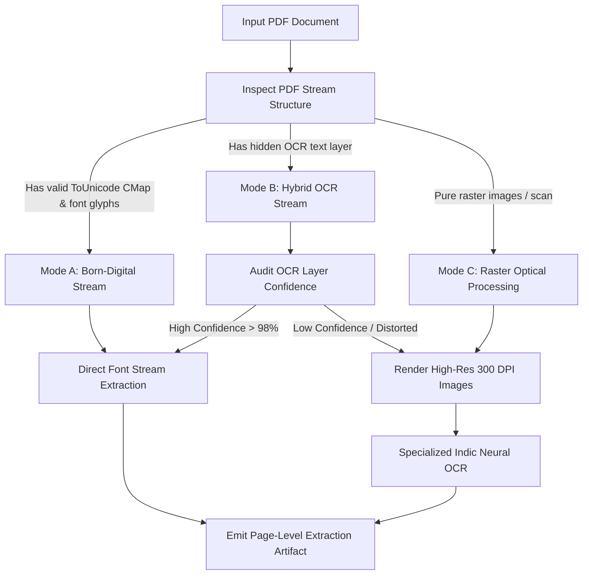

# DARŚANA — ROADMAP SESSION 4
# SOURCE INGESTION, PROVENANCE, RIGHTS & EDITORIAL PIPELINE

**Document Status:** Frozen / Authoritative Specification  
**Governing Charters:** [ROADMAP_SESSION_1.md](./ROADMAP_SESSION_1.md) (Product Vision), [ROADMAP_SESSION_2.md](./ROADMAP_SESSION_2.md) (Technical Architecture), [ROADMAP_SESSION_3.md](./ROADMAP_SESSION_3.md) (Canonical Knowledge Model)  
**Scope:** Defines the complete architecture, stages, algorithms, verification gates, rights management, and editorial governance for transforming raw external sources (including Google Drive PDFs, scans, and critical editions) into the Darśana Canonical Knowledge Core.

---

## 1. Purpose & Guiding Invariant

The purpose of this session is to design the **Source Ingestion Engine and Editorial Governance Pipeline** for Darśana.

### 1.1 The Ingestion Invariant
> **No source material enters the canonical knowledge base without provenance, rights classification, structural identification, validation, and appropriate human review.**

External sources are treated as **untrusted, multi-layered historical artifacts**. The pipeline must never:
1. Synthesize an artificial consensus where traditions or witnesses diverge.
2. Silently alter, correct, or modernize a historical reading without recording a distinct witness and variant.
3. Conflate digital availability (e.g., an open Google Drive link) with copyright clearance.
4. Allow automated machine processes or AI heuristics to publish unvetted assertions as canonical truth.

---

## 2. The Comprehensive Source Lifecycle

Every ingested source progresses through a 15-stage deterministic, auditable lifecycle:

```
[ Stage 01: Source Discovery & Registration ]
                       │
                       ▼
[ Stage 02: Acquisition & Integrity Hashing (SHA-256) ]
                       │
                       ▼
[ Stage 03: Legal & Rights Classification ]
                       │
                       ▼
[ Stage 04: Bibliographic Metadata Verification ]
                       │
                       ▼
[ Stage 05: Document Layout & Extraction (Text / OCR) ]
                       │
                       ▼
[ Stage 06: Structural Hierarchy & Block Segmentation ]
                       │
                       ▼
[ Stage 07: Sūtra / Verse Identification & Coordinate Aliasing ]
                       │
                       ▼
[ Stage 08: Multi-Script Normalization & Phonetic Transcription ]
                       │
                       ▼
[ Stage 09: Translation & Commentary Exegesis Extraction ]
                       │
                       ▼
[ Stage 10: Page-Level Coordinate & Bounding Box Binding ]
                       │
                       ▼
[ Stage 11: AI-Assisted Pedagogical Draft Scaffolding ]
                       │
                       ▼
[ Stage 12: Deterministic Schema & Link Validation Gates ]
                       │
                       ▼
[ Stage 13: Multi-Tiered Human Scholarly Review ]
                       │
                       ▼
[ Stage 14: Canonical Knowledge Promotion & Versioning ]
                       │
                       ▼
[ Stage 15: Artifact Compilation (Search & Graph Indices) ]
```

### 2.1 Detailed Stage Governance

| Stage | Inputs | Outputs | Automation Level | Failure Conditions | Human Responsibility |
| :--- | :--- | :--- | :--- | :--- | :--- |
| **01. Discovery** | Source URI (Google Drive / Archive) | `SourceManifest` (Pending) | Semi-Automated | Unreachable URL, malformed link | Input URL and initial context |
| **02. Acquisition** | Raw PDF stream | Binary asset + SHA-256 hash | Automated (CLI) | Network timeout, hash mismatch | None |
| **03. Rights Class.** | Bibliographic context | `RightsDeclaration` | **Human-Governed** | Ambiguous license, pending status | Determine legal status & restrictions |
| **04. Biblio. Verif.** | Title page, colophon scan | Verified `BibliographicData` | AI-Assisted + Human | Missing publisher, uncertain date | Review and approve metadata |
| **05. Extraction** | Raw PDF pages | Layered Page Artifacts (JSON) | Automated (Engine) | OCR failure, unreadable scan | Flag corrupted / blurred pages |
| **06. Struct. Parse** | Extracted page tokens | Semantic Block Stream | Heuristic + AI | Irregular headers, unrecognized font | Review chapter boundaries |
| **07. Verse Ident.** | Block stream | Verse Candidate Entities | Algorithmic | Discrepant verse numbers | Map to canonical coordinate matrix |
| **08. Script Proc.** | Devanāgarī root text | Malayalam transcript + IAST | **Deterministic Engine** | Ill-formed conjunct, bad virāma | Audit phonetic fidelity |
| **09. Exegesis Ext.** | Commentary blocks | Commentary & Translation records | AI-Assisted | Conflated text & commentary | Verify commentary attribution |
| **10. Provenance** | Extracted texts + PDF pages | `SourceWitness` records | Automated | Missing page reference | Spot-check bounding coordinates |
| **11. Scaffolding** | Canonical verse | Draft 7-Step Primer | AI-Assisted Draft | Jargon in Step 1, weak analogy | Complete rewrite / polish |
| **12. Validation** | Draft canonical JSON | Validation Report (Pass/Fail) | **100% Deterministic** | Broken links, schema violation | Fix rejected data points |
| **13. Human Review** | Staged entities | Signed Review Certification | **Human Mandatory** | Scholarly objection, linguistic flaw | Sign-off on doctrinal fidelity |
| **14. Promotion** | Approved staging | Git commit in `/canonical/` | Automated CLI | Git merge conflict | Commit to main branch |
| **15. Compilation** | Canonical repository | Production chunks + search | Automated CI/CD | Build memory crash, index fail | Verify deployment status |

---

## 3. Google Drive Acquisition Model

Google Drive is the initial intake mechanism for primary literature, critical editions, and scans.

### 3.1 Separation of Acquisition Vector from Intellectual Source
> **A Google Drive link is an acquisition transport, NEVER the intellectual source.**

The system strictly decouples the **Acquisition Record** from the **Bibliographic Source**:
* **Acquisition Record:** Describes *where, when, and how* the digital file was retrieved (e.g., `drive.google.com/file/d/1A2B3C...`, downloaded on `2026-09-21`, size: `322.3 MB`, SHA-256: `a9f4c8...`).
* **Bibliographic Source:** Describes *who authored, edited, and published* the work (e.g., *Sampurnanand Sanskrit University, 1998, edited by Pt. Girijesh Kumar Dikshit*).

### 3.2 Acquisition Schema (`GoogleDriveAcquisition`)
```typescript
export interface GoogleDriveAcquisition {
  acquisitionId: string; // 'urn:darshana:acq:gdrive:1A2B3C4D5E'
  googleDriveUrl: string;
  fileId: string; // Google Drive File ID
  retrievalTimestamp: string; // ISO 8601
  originalFileName: string;
  mimeType: string;
  byteLength: number;
  sha256: string;
  accessClassification: 'public-link' | 'service-account-auth' | 'restricted';
  storageMirrorPath: string; // Local / S3 archival mirror
  status: 'acquired' | 'verified' | 'failed' | 'superseded';
}
```

---

## 4. Source Identity & Deterministic Deduplication

Sources arrive from diverse origins: fresh scans, re-uploaded Google Drive links, compressed PDFs, and varied printings.

### 4.1 Deduplication Hierarchy

```
                                [ Incoming File ]
                                        │
                         Is SHA-256 byte-identical?
                                ├── YES ──▶ [ Identical Digital Clone ] (Record acquisition, skip extraction)
                                └── NO
                                        │
                         Is OCR text & page count identical?
                                ├── YES ──▶ [ Alternative Scan / Re-compression ] (Link to existing Edition)
                                └── NO
                                        │
                     Same title, publisher, and year, but new scans?
                                ├── YES ──▶ [ Distinct Physical Witness ] (Register new Edition Witness)
                                └── NO
                                        │
                     Same root text, but different editor / year?
                                ├── YES ──▶ [ Distinct Historical Edition ] (Register new Source Edition)
                                └── NO
                                        ▼
                                [ Entirely New Source ]
```

### 4.2 Definition of Identity States
1. **Identical Digital Source:** Byte-for-byte identical SHA-256 hash.
2. **Equivalent Edition:** Different digital scan or compression of the identical printing (matches ISBN, publisher, date, pagination, and typography).
3. **Related Edition:** A revised edition, new volume, or different commentary on the same root text.
4. **Distinct Source:** An independent publication or distinct manuscript lineage.

---

## 5. Multi-Mode PDF Extraction Strategy

PDFs are ingested through three distinct execution pathways based on their digital composition:



* **Preservation of Page Boundaries:** Every extracted word token preserves its page number and bounding box coordinates `[x0, y0, x1, y1]`, enabling future UI viewers to highlight the exact visual region of the original scan.

---

## 6. Specialized Indic OCR & Confidence Modeling

Indic scripts (Devanāgarī, Malayalam) feature complex vertical conjuncts (*kūṭṭakṣaraṅṅaḷ*), vowel diacritics (*mātrās*), anusvāra, and virāma that defeat standard Western OCR models.

### 6.1 Multi-Script OCR Engine Pipeline
1. **Pre-processing:** Deskewing, adaptive binarization (Otsu/Sauvola), border artifact removal, and resolution upscaling to 300–400 DPI.
2. **Layout & Script Segmentation:** Separates headers, footers, Sanskrit verse blocks (often centered or indented), commentary prose, and footnotes. Detects script per block (Devanāgarī vs. Malayalam vs. Latin).
3. **Indic Neural Recognition:** Utilizes specialized Indic OCR models trained on traditional print ligatures and Vedic accents.
4. **Post-OCR Lexical Spelling Alignment:** Matches extracted Sanskrit words against a pre-compiled Śāstric vocabulary dictionary (*Amarakoṣa*, Monier-Williams, Vācaspatyam) without altering original readings.

### 6.2 The OCR Confidence Model
Every extracted text token carries a confidence score $C \in [0.0, 1.0]$ computed from:
* Tesseract / OCR engine character probabilities.
* Unicode conjunct validity (penalizing illegal virāma sequences).
* Sanskrit grammatical dictionary validity.

$$\text{Block Confidence} = \frac{1}{N} \sum_{i=1}^N C_{\text{token}_i}$$

* **Human Review Threshold:** Any block with $C < 0.92$ is automatically quarantined for **Level 2 Editorial Review**.

---

## 7. Page-Level Provenance & Traceability

Every assertion, translation, and commentary layer in Darśana must trace back to its physical origin.

```
[ Canonical Entity ]
        │ (generated from)
        ▼
[ Extraction Candidate ]
        │ (extracted from)
        ▼
[ Page Coordinate Bounding Box ] ── Page 142, [x: 54, y: 120, w: 480, h: 65]
        │ (located within)
        ▼
[ Page Scan Image ] ── SHA-256 page raster
        │ (page of)
        ▼
[ PDF Acquisition Record ] ── SHA-256: e3b0c4...
        │ (instance of)
        ▼
[ Edition / Publication ] ── SSU Varanasi 1998, Vol 1
```

A scholar inspecting a verse in the UI can click **"View Source Witness"** to see the actual high-resolution snippet of the printed book from which the text was transcribed.

---

## 8. Structural Parsing & Hierarchy Detection

The pipeline applies structural grammar rules to split the raw text stream into śāstric units:

```
[ Title / Front Matter ]
[ Introductory Upodghāta / Bhūmikā ]
[ Chapter / Pāda / Āhnika Header ]
[ Root Verse / Sūtra / Kārikā ]  ◀── Distinct typography / indentation / danda
[ Padavibhāga / Anvaya (if printed) ]
[ Traditional Commentary (Bhāṣya) ] ◀── "ഇതി ശ്രീമത്...", "अत्रोच्यते..."
[ Sub-commentary (Ṭīkā) ]
[ Editorial Footnotes & Critical Variants ]
```

* **Heuristic Anchors:** Detects canonical opening and closing markers (e.g., `॥ इति ... समाप्तम् ॥`, `अथ ... जिज्ञासा`, `॥ १ ॥`).
* **Irregular Formats:** When a book intermingles root sūtras and commentary without distinct fonts, the pipeline switches to **Semi-Automated Boundary Splitting**, presenting candidate demarcation lines to an editor.

---

## 9. Verse Identification & Coordinate Aliasing

Mapping an extracted verse to its canonical anchor uses the **Coordinate Alias Engine** from Session 3.

### 9.1 The Coordinate Alias Matrix
```json
{
  "canonicalVerseId": "urn:darshana:verse:nyaya-sutra:2.1.68",
  "witnesses": [
    {
      "sourceId": "urn:darshana:source:ssu-nyaya-dikshit",
      "edition": "1998-print",
      "printedNumber": "2.1.68",
      "pageNumber": 142
    },
    {
      "sourceId": "urn:darshana:source:kashi-nyaya-bhasya",
      "edition": "1920-ch大事",
      "printedNumber": "2.1.69",
      "pageNumber": 98,
      "discrepancyReason": "Combines previous two sutras into one, shifting count by +1"
    }
  ]
}
```

---

## 10. Source Witnesses Architecture

A canonical verse is not a single string; it is witnessed by historical editions:

```typescript
export interface SourceWitness {
  witnessId: string; // 'urn:darshana:witness:samkhya-karika:1:ssu-1970'
  verseId: string; // 'urn:darshana:verse:samkhya-karika:1'
  sourceId: string; // 'urn:darshana:source:ssu-samkhya-1970'
  pageNumber: number;
  boundingBox?: [number, number, number, number];
  
  /* Verbatim Witness Reading */
  witnessReadingDevanagari: string;
  hasPunctuationVariations: boolean;
  hasWordSubstitutions: boolean;
  
  /* Critical Apparatus */
  editorialNotes?: string;
  verifiedBy: string; // Reviewer ID
  verificationTimestamp: string;
}
```

---

## 11. Deterministic Script Processing Pipeline

The conversion from Sanskrit Devanāgarī to Malayalam transcription and IAST is **100% deterministic and rule-governed**.

```
[ Sanskrit Devanāgarī (NFC) ]
              │
              ▼
[ Unicode Normalizer & Sanity Gate ] ── Rejects illegal accents & invalid nuktas
              │
              ▼
[ Phonetic Character Stream (Abstract Phonemes) ]
              │
      ┌───────┴───────┐
      ▼               ▼
[ Devanāgarī ──▶ IAST ]  [ Devanāgarī ──▶ Malayalam Script Transcription ]
(Strict NFC Macrons)      (Traditional Malayalam Sanskrit Transcription)
```

### 11.1 Meaning vs. Pronunciation Invariant
> **Malayalam-script transcription is purely phonological transcription, NEVER translation.**

The text remains pure Sanskrit (*Gīrvāṇa-bhāṣā*), represented visually in Malayalam letterforms so that native Malayalam speakers can chant and read the original verses with absolute phonetic precision.

---

## 12. Malayalam Sanskrit Transcription Engine

The transcription engine must accurately map the complete phonology of Sanskrit into Malayalam script:

### 12.1 Phonological Transformation Rules
1. **Sanskrit Vowels:**
   * $a, \bar{a}, i, \bar{\imath}, u, \bar{u} \longrightarrow$ അ, ആ, ഇ, ഈ, ഉ, ഊ.
   * Vocalic $ṛ, \bar{ṛ} \longrightarrow$ ഋ, ൠ.
   * Vocalic $ḷ, \bar{ḷ} \longrightarrow$ ഌ, ൡ.
   * Diphthongs $e, ai, o, au \longrightarrow$ ഏ, ഐ, ഓ, ഔ.
2. **Sanskrit Consonants (Complete 5 Varga Matrices):**
   * Velar: ക, ഖ, ഗ, ഘ, ങ.
   * Palatal: ച, ഛ, ജ, ഝ, ഞ.
   * Retroflex: ട, ഠ, ഡ, ഢ, ണ.
   * Dental: ത, ഥ, ദ, ധ, ന.
   * Labial: പ, ഫ, ബ, ഭ, മ.
   * Semi-vowels & Sibilants: യ, ര, ല, വ, ശ, ഷ, സ, ഹ.
3. **Special Diacritics:**
   * Anusvāra ($ṃ$) $\longrightarrow$ Malayalam Anusvāra (ം, `U+0D02`).
   * Visarga ($ḥ$) $\longrightarrow$ Malayalam Visarga (ഃ, `U+0D03`).
   * Avagraha ($'$) $\longrightarrow$ Malayalam Avagraha (ഽ, `U+0D3D`).
   * Pure Virāma (Chandrakkala) $\longrightarrow$ `U+0D4D` (്).

---

## 13. Translation Ingestion Pipeline

When translations are extracted from printed books:
1. **Verbatim Preservation:** The translation is captured word-for-word as published in the source.
2. **Attribution Binding:** Permanently bound to the translator's name, book title, year, and page.
3. **Legal Gate:** If the translation is copyrighted and lacks an open license, the pipeline **disables public reproduction**, generating an editorial paraphrase or routing the text to Level 6 Rights Review.
4. **Non-Destructive Coexistence:** Existing translations are never overwritten; the new translation is appended as an alternate translation in the `translationIds` array.

---

## 14. Commentary Exegesis Ingestion

Commentaries are parsed, structured, and cataloged hierarchically:

```
[ Extract Commentary Block ]
             │
             ▼
[ Detect Commentator & School ] ── e.g., Śaṅkara / Advaita
             │
             ▼
[ Check Hierarchy ]
   ├── Is it on the root text? ──▶ Link to Canonical Verse as 'mula-bhasya'
   └── Is it on an earlier Bhasya? ──▶ Link to Parent Commentary as 'tika'
             │
             ▼
[ Split Sanskrit Root Exegesis from Local Translation ]
             │
             ▼
[ Generate Digest / Core Exegesis Summary ] ◀── AI-Assisted, Human Verified
```

---

## 15. Copyright, Licensing & Permissions Governance

```
                                  [ INGESTED SOURCE ]
                                           │
                          Is the publication year < 1925?
                                ├── YES ──▶ [ Public Domain Worldwide ] (Full reproduction allowed)
                                └── NO
                                           │
                     Is it published in India before 1958 (Author + 60)?
                                ├── YES ──▶ [ Public Domain in India ] (Full reproduction allowed)
                                └── NO
                                           │
                     Does the source declare an Open License (CC-BY/CC0)?
                                ├── YES ──▶ [ Open License Approved ] (Full reproduction with attribution)
                                └── NO
                                           ▼
                            [ In-Copyright / Rights Protected ]
                                           │
        ┌──────────────────────────────────┴──────────────────────────────────┐
        ▼                                                                     ▼
[ Permitted Under Fair Use ]                                      [ Prohibited Under Fair Use ]
• Factual coordinate taxonomies                                   • Full verbatim translation
• Short critical excerpts (< 100 words)                          • Full verbatim commentary reproduction
• Metadata & citations                                            • Complete digitized facsimile republishing
• Original Darśana summaries                                      
```

### 15.1 The Strict Protection Rule
> **"Anyone can download or view this PDF" does not confer redistribution rights.**

When copyright status is uncertain, the system defaults to **Restricted Mode**:
* Store the scan and extraction internally for reference and indexing.
* Publish **only** metadata, citations, and independently authored Darśana educational summaries.
* Provide an outbound link or institutional reference directing readers to the physical or original digital repository.

---

## 16. Multi-Source Merging Engine (Deterministic & Additive)

When Source $N$ provides data for an existing Verse $V$:
1. **The Merge is Always Additive:** No field in $V$ is deleted.
2. **Witness Creation:** A new `SourceWitness` is attached to $V$.
3. **Reading Comparison:** If Source $N$ has a different reading, a new `TextualVariant` is appended.
4. **Translation Stacking:** If Source $N$ includes a translation, it is appended to `translations.ml` or `translations.en`.
5. **Commentary Stacking:** If Source $N$ includes a commentary, a new `TraditionalCommentary` entity is registered.

---

## 17. AI-Assisted Processing: Strict Operational Boundaries

Artificial Intelligence is employed as a **high-speed drafting assistant**, never an unmonitored author.

### 17.1 Permitted vs. Prohibited AI Activities

| Permitted AI Use Cases (Draft Mode) | Strictly Prohibited AI Activities |
| :--- | :--- |
| • OCR post-processing & ligature correction | • Inventing historical attributions or dates |
| • Detecting verse coordinates from context | • Fabricating philosophical reconciliations |
| • Generating initial draft word glosses (*padārtha*) | • Publishing unreviewed translations as canonical |
| • Proposing candidate cross-system concept links | • Altering original Sanskrit readings to fit translations |
| • Drafting initial 7-step beginner primers | • Bypassing validation gates or human review |

---

## 18. Multi-Tiered Human Scholarly Review

Entities cannot reach `published` status without meeting defined review criteria:

```
[ Level 1: Automated Validation ] ── 100% automated; blocking syntax/link errors
          │
          ▼
[ Level 2: Editorial Review ] ── Language hygiene, spelling, markdown integrity
          │
          ▼
[ Level 3: Linguistic Review ] ── Sanskrit syntax, Malayalam transcription accuracy
          │
          ▼
[ Level 4: Philosophical Review ] ── Lineage correctness, absence of synthetic conflation
          │
          ▼
[ Level 5: Provenance Review ] ── Spot-check against original PDF scan coordinates
          │
          ▼
[ Level 6: Rights & Legal Review ] ── Final copyright verification and sign-off
```

---

## 19. Content Confidence & Uncertainty Vector

Instead of a single misleading "quality score", each entity carries a 6-dimensional **Confidence Vector**:

```typescript
export interface QualityConfidenceVector {
  ocrConfidence: number;           // [0.0 - 1.0] Physical text extraction clarity
  extractionConfidence: number;    // [0.0 - 1.0] Structural segmentation accuracy
  transcriptionConfidence: number; // [0.0 - 1.0] Phonetic transcription certainty
  metadataConfidence: number;      // [0.0 - 1.0] Publisher/year/author verification
  attributionConfidence: number;   // [0.0 - 1.0] Commentator lineage certainty
  philosophicalConfidence: number; // [0.0 - 1.0] Doctrinal interpretation review
}
```

---

## 20. Error Correction & Audit Trail Architecture

When an error is discovered in a published entity:
1. **Never Silently Mutate:** The historical commit remains in Git history.
2. **Supercession Record:** A correction commit is created documenting:
   * `correctedBy`: Scholarly reviewer ID.
   * `timestamp`: ISO 8601.
   * `justification`: Detailed philological or factual reason.
   * `sourceEvidence`: Specific manuscript or edition citation proving the correction.

---

## 21. Intermediate Ingestion Artifacts

The pipeline preserves intermediate artifacts in a structured directory hierarchy:

```
/ingestion/
  ├── 01_raw_sources/          [ Immutable raw PDFs / Scans ]
  ├── 02_page_rasters/         [ 300 DPI page images for OCR verification ]
  ├── 03_extracted_tokens/     [ Word tokens with [x,y,w,h] bounding boxes ]
  ├── 04_structured_blocks/    [ Segmented chapters, verses, commentaries ]
  ├── 05_staging_entities/     [ Unreviewed candidate JSON entities ]
  └── 06_quarantine/           [ Low-confidence or schema-rejected items ]
```

* **Permanence Policy:** Raw sources (`01`) and page rasters (`02`) are preserved permanently in cold storage. Structured blocks (`04`) and staging entities (`05`) can be regenerated deterministically by re-running pipeline scripts.

---

## 22. Deterministic Validation Gates

A build fails and execution halts if any of the following gates fail:
1. **Source Hash Integrity Gate:** All ingested sources have verified SHA-256 signatures.
2. **Dangling Edge Gate:** Zero knowledge graph edges point to nonexistent entities.
3. **Mandatory Verse Layer Gate:** Every published verse has Devanāgarī, Malayalam script transcription, IAST, at least one translation, and a 7-step beginner primer.
4. **Unicode Purity Gate:** Rejects corrupted Indic characters, legacy chillus, or malformed joiners.
5. **Rights Compliance Gate:** Entities lacking a declared rights classification cannot be published.

---

## 23. Source Versioning Engine

* **New Source Edition:** Results in a new `urn:darshana:source:*` entity and new `SourceWitness` records attached to existing canonical verses.
* **Correction to Darśana Editorial Content:** Increments the editorial revision version (`schemaVersion` / Git commit) of the canonical entity, leaving source witnesses intact.

---

## 24. Auditability & Reproducibility Matrix

To ensure identical pipeline execution yields identical output:
```json
{
  "pipelineVersion": "darshana-pipeline-v1.0.0",
  "ocrEngine": "tesseract-indic-5.3.0",
  "transcriptionRuleset": "darshana-ml-trans-v1.2",
  "sourceSha256": "e3b0c44298fc1c149afbf4c8996fb92427ae41e4649b934ca495991b7852b855",
  "executionTimestamp": "2026-09-21T08:30:00Z"
}
```

---

## 25. Security & Untrusted Input Sanitization

Because PDFs originate from third-party links:
1. **Decompression Bomb Defense:** Enforces strict limits on PDF memory allocation and uncompressed raster dimensions.
2. **Embedded Script Stripping:** Strips all JavaScript, forms, and embedded executable streams before processing.
3. **Prompt Injection Defense:** Text extracted from external PDFs is treated strictly as **untrusted data**. When fed into AI-assisted summarization models, it is isolated in dedicated data delimiters to prevent prompt injection or instructions embedded in historical texts from altering system behavior.

---

## 26. End-to-End Ingestion Example: Sampurnanand Sāṅkhya Kārikā

```
[ Step 1: Input ]
Google Drive URL: https://drive.google.com/file/d/1X9Y8Z...

[ Step 2: Ingestion & Hash ]
Downloaded: "samkhya_karika_ssu_1970.pdf" (14.2 MB)
SHA-256: 7f83b1657ff1fc53b92dc18148a1d65dfc2d4b1fa3d677284addd200126d9069

[ Step 3: Rights Classification ]
Sampurnanand Sanskrit Vishwavidyalaya, 1970.
Root Sanskrit text: Public Domain.
Gauḍapāda-bhāṣya: Public Domain.
Hindi translation: In-copyright; restricted to scholarly citation.

[ Step 4: Page OCR & Extraction ]
Page 12 detected: Sāṅkhya Kārikā Verse 1.
Confidence: 0.982.
Coordinates: Box [45, 120, 520, 80].

[ Step 5: Verse Identification ]
Coordinates match Canonical Verse: 'urn:darshana:verse:samkhya-karika:1'.
Creates Source Witness: 'urn:darshana:witness:samkhya-karika:1:ssu-1970'.

[ Step 6: Deterministic Script Transcription ]
Devanāgarī: "दुःखत्रयाभिघाताज्जिज्ञासा..."
Malayalam Script Transcription generated: "ദുഃഖത്രയാഭിഘാതാജ്ജിജ്ഞാസാ..."
IAST generated: "duḥkhatrayābhighātājjijñāsā..."

[ Step 7: Commentary Separation ]
Gauḍapāda-bhāṣya block extracted.
Created entity: 'urn:darshana:commentary:samkhya-karika:gaudapada:1'.

[ Step 8: AI-Assisted Scaffolding ]
Drafts 7-step beginner explanation in Malayalam and Indian English.

[ Step 9: Human Review ]
Editorial & Sanskrit review by scholars. Certified and signed off.

[ Step 10: Promotion & Publication ]
Committed to `/content/canonical/`.
Compiled into client chunk `/public/data/texts/samkhya-karika/chapter-1.json`.
```

---

## 27. Migration of Existing Repository Content

Material currently inside `src/content/` is categorized into an actionable migration matrix:

| Current Repository Material | Status | Destination Pipeline Action |
| :--- | :--- | :--- |
| **Sāṅkhya Kārikā (72 verses)** | High quality | Promote immediately to canonical; generate missing Padaccheda/Anvaya. |
| **Yoga Sūtras (195 sūtras)** | High quality | Promote to canonical; extract Vyāsa-bhāṣya into `TraditionalCommentary`. |
| **Nyāya Sūtras (Book 1-5)** | High quality | Promote; apply Coordinate Alias Matrix for Book 2 discrepancies. |
| **Devī Māhātmya (13 Chapters)** | Verified | Promote; link to SSU Durga Saptashati source metadata. |
| **Adhyātma Rāmāyaṇa (7 Kāṇḍas)** | Verified | Promote to canonical. |
| **Bhagavad Gītā (18 Chapters)** | Verified | Promote; attach classical commentaries. |
| **Viṣṇu / Lalitā Sahasranāma** | High quality | Stotras map to `Verse`; 1000 names map to `Concept` entities. |
| **Untracked PDFs / Text Dumps** | Untracked | Route into Session 4 Ingestion Pipeline via Stage 1 Source Discovery. |

---

## 28. Complete Ingestion Architecture Diagram

```
                 [ EXTERNAL WORLD: GOOGLE DRIVE / ARCHIVE.ORG / SCANS ]
                                           │
                                           ▼
                 [ 1. Intake, Hashing (SHA-256) & Duplicate Detection ]
                                           │
                                           ▼
                 [ 2. Bibliographic Registry & Rights Classification ]
                                           │
                                           ▼
                 [ 3. Optical Extraction & Layout Segmentation Engine ]
                                           │
                     ┌─────────────────────┴─────────────────────┐
                     ▼                                           ▼
          [ Born-Digital Stream ]                     [ Neural Indic OCR ]
          (Direct CMap Extraction)                    (300 DPI + Devanāgarī/ML)
                     │                                           │
                     └─────────────────────┬─────────────────────┘
                                           ▼
                 [ 4. Structural Parsing & Canonical Coordinate Alias ]
                                           │
                                           ▼
                 [ 5. Deterministic Indic Transcription Engine ]
                 (Devanāgarī ──▶ Malayalam Script Transcription + IAST)
                                           │
                                           ▼
                 [ 6. Exegesis & Commentary Separation Engine ]
                                           │
                                           ▼
                 [ 7. AI-Assisted Pedagogical Scaffolding (Draft Mode) ]
                                           │
                                           ▼
                 [ 8. Deterministic Validation Gates (Zero Broken Links) ]
                                           │
                                           ▼
                 [ 9. Multi-Tiered Human Scholarly Review & Certification ]
                                           │
                                           ▼
                 [ 10. Canonical Knowledge Core (Git Committed JSON) ]
                                           │
                                           ▼
                 [ 11. Build-Time Chunker, Search Indexer & Graph Compiler ]
                                           │
                                           ▼
                                 [ DARŚANA CLIENT APP ]
```

---

## 29. Unresolved Decisions (Deliberately Postponed)

To preserve strategic flexibility, the following implementation choices remain open:
1. **Specific OCR Runtime:** Final selection between Tesseract 5 with custom Indic traineddata, Google Cloud Vision API, or a self-hosted Surya/TrOCR pipeline is deferred to implementation.
2. **Specific CMS / Editorial UI:** Selection between a local desktop GUI, a Git-based web portal (e.g., Decap/Tina CMS), or CLI scripts is deferred to tooling phases.
3. **Database vs. Flat-File Authoring:** Whether unreviewed staging content resides in SQLite or structured Git branches is deferred to pipeline tooling execution.

---

## 30. Architectural Consequences for Session 5 (UI/UX Architecture)

Session 4 delivers concrete parameters that dictate Session 5 (UI/UX Design):
1. **Visual Snippet Inspection:** The UI must support opening a modal displaying the exact page image snippet from the source witness.
2. **Layer Toggling:** The reader interface must offer toggles for each of the 12 textual layers without cluttering the screen.
3. **Rights-Aware UI Rendering:** The UI must display appropriate licensing badges and attribution banners for in-copyright educational fair-use materials.

---

## 31. Charter Status

This document is frozen.  
It serves as the immutable architectural specification for the **Darśana Source Ingestion, Provenance, Rights and Editorial Pipeline**.
